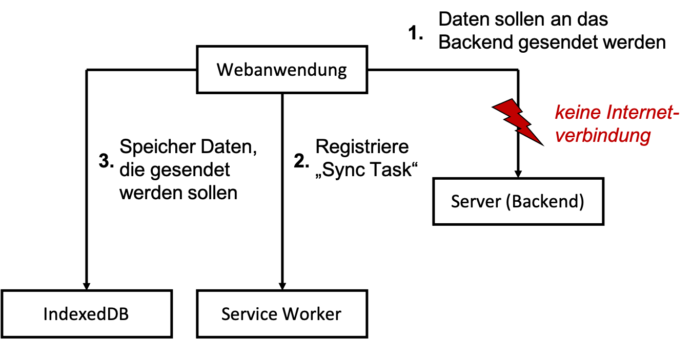
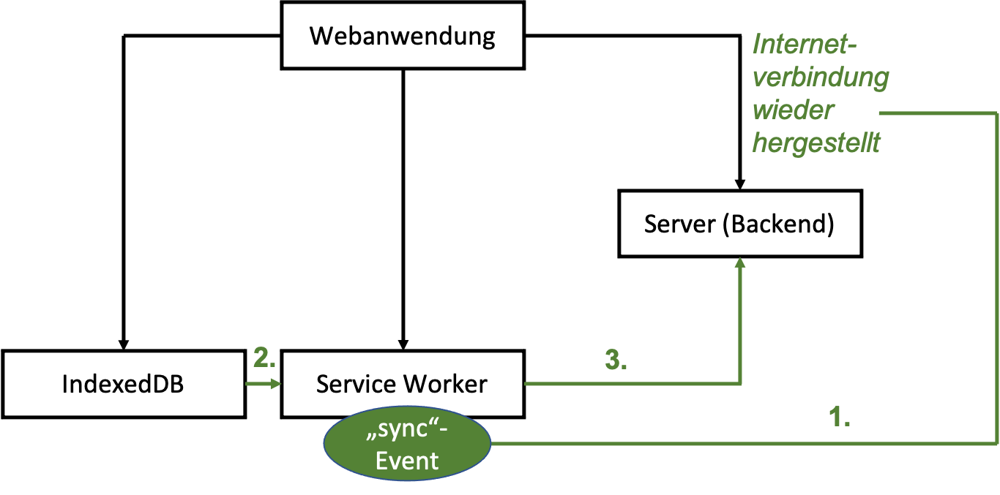

# Hintergrundsynchronisation

Hintergrundsynchronisation erlaubt die Synchronisation von daten, selbst dann, wenn die Anwendung offline ist. Diese "Synchronisation" erfolgt natürlich "asynchron". Angenommen, Sie geben offline Daten in die Anwendung ein und wollen diese versenden, z.B. an das Backend, dann wird dieser Request so lange in Ihrer Anwendung gespeichert, bis Sie wieder online sind und erst dann ausgeführt. 

Das Situation ist die Folgende:



Es sollen Daten an das Backend gesendet werden, aber die Internetverbindung ist unterbrochen. Deshalb werden die Daten in die IndexedDB gespeichert und im Service Worker wird eine *Sync Task* registriert. 



Sobald die Verbindung wieder steht, wird ein *Sync*-Event im Service Worker ausgelöst und dieser sendet die Daten an das Backend (`POST-Request`).

Dadurch, dass der Service Worker diesen `POST-Request` ausführt (und die Daten dabei mitsendet), kann die Hintergrundsynchronisation sogar dann stattfinden, wenn die Webanwendung bereits geschlossen ist! Deshalb sollten wir einfach immer beim Senden von Daten eine *Sync Task* registrieren, weil es sein kann, dass die Daten noch gar nicht vollständig gesendet wurden, bevor wir den Browsertab schließen. 

### Zunächst ein bisschen mehr responsive

Unser *HTW Insta* entwickelt sich langsam. Deshalb ist hier vielleicht ein guter Zeitpunkt, um die Anwendung noch etwas mehr *responsive* zu gestalten. Zum Beispiel sind die `Cards` stets in fester Größe, unabhängig davon, ob wir die Anwendung am Desktop betrachten oder am Mobilgerät. 

Dazu können wir in unsere `feed.css` ein paar *Media queries* einfügen:

=== "/src/css/feed.css"
	```css
	#create-post {
	    z-index: 1001;
	    position: fixed;
	    width: 100%;
	    min-height: 100vh;
	    overflow-y: scroll;
	    bottom: 0;
	    top: 56px;
	    background: white;
	    text-align: center;
	    visibility: hidden;
	}

	.main-image {
	    max-width: 100%;
	    margin: auto;
	    display: block;
	}

	.whiteText {
	    color: white;
	}

	.floating-button {
	    z-index: 1000;
	    position: fixed;
	    bottom: 0;
	    right: 0;
	    padding: 30px;
	}

	.input-section {
	    display: block;
	    margin: 10px auto;
	}

	.shared-moment-card.mdl-card {
	    margin: 10px auto;
	    width: 80%;
	}

	@media (min-width: 600px) {
	    .shared-moment-card.mdl-card {
	        width: 60%;
	    }
	}

	@media (min-width: 1200px) {
	    .shared-moment-card.mdl-card {
	        width: 45%;
	    }
	}

	.shared-moment-card .mdl-card__title {
	    height: 250px;
	}

	@media (min-height: 600px) {
	    .shared-moment-card .mdl-card__title {
	        height: 300px;
	    }
	}

	@media (min-height: 1200px) {
	    .shared-moment-card .mdl-card__title {
	        height: 380px;
	    }
	}		
	```

Wir haben sowohl für die Viewport-Höhe als auch für die Viewport-Breite zwei *Breakpoints* eingebaut. Bei jeweils `600px` bzw. `1200px` ändern sich die Angaben zur Höhe bzw. Breite der Bilder in den `Cards`. **Achtung:** In `feed.js` muss dazu die Zeile 

```
cardTitle.style.height = '180px';
```

gelöscht werden! Die Höhe und Breite der Bilder in den `Cards` passt sich jetzt (besser)  der Viewport-Breite und -Höhe an. Bei den Breiten haben wir sogar %-Angaben verwendet (gut), bei den Höhen nur feste Pixel-Werte (nicht so gut). Sie können gerne damit herumspielen und es an Ihre Bedürfnisse anpassen. 

Die Verwendung der Bilder können wir noch auf eine andere Art *responsive* gestalten. Je nach Viewport-Größe können die Bilder eingebunden werden, deren Auflösung "ausreicht". In dem `/public/src/images/`-Ordner haben wir für unser Hauptbild oben drei verschiedene Versionen:

- `htw.jpg`, mit der Auflösung `898 x 343` Pixel,
- `htw-lg.jpg`, mit der Auflösung `1199 x 457` Pixel und
- `htw-sm.jpg`, mit der Auflösung `480 x 183` Pixel.

Es wäre unsinnig, beisielsweise das `htw-lg.jp` auf einem schmalen Viewport anzuzeigen, da dafür die Auflösung des `htw-sm.lpg` völlig genügt. Da Letzteres auch noch deutlich kleiner ist (`43 KB`), als das `htw-lg.jpg`-Bild (`170 KB`), ließe sich auch die Ladezeit verringern, wenn für mobile Geräte das kleiner Bild verwendet würde. Auf der anderen Seite sieht dieses Bild aufgrund seiner niedrigen Auflösung in großen Viewports (also am Desktop-Monitor) nicht gut aus. Dort benötigen wir das `htw-lg.jpg`. Um diesen Wechsel der Bilder je nach Viewport-Größe zu vereinfachen, wurde in HTML5 für das `img`-Element das Attribut `srcset` hinzugefügt (siehe z.B. [hier](https://developer.mozilla.org/en-US/docs/Learn/HTML/Multimedia_and_embedding/Responsive_images)  oder [hier](https://html.com/attributes/img-srcset/)). In unserer `index.html` können wir also das Einbinden des `img`-Elementes wie folgt erweitern:


=== "/index.html"
	```html linenums="1"
	
	```

Zuvor stand dort einfach nur: ``. Wir haben also das `srcset`-Attribut hinzugefügt. Das generelle Template dafür sieht so aus:

```html

```

Das heißt, nach den URLs auf die jeweiligen Bilder schreiben wir noch die Größe des Viewports, ab denen die Bilder verwendet werden sollen, also `1200w, 900w, 480w`. Dabei steht `w` für `width`. Möglich wäre 

### Daten senden

In unserer *HTW Insta*-Anwendung sorgen wir nun zunächst dafür, dass wir auch Daten eingeben und diese versenden können. Ausgangspunkt ist dieser [Stand des Projektes](./files/IKT-PWA-05.zip).

Wir wollen dazu den `Speichern`-Button aus der `index.html` 

```html linenums=76
<button class="mdl-button mdl-js-button mdl-button--raised mdl-button--colored mdl-color--accent"
        type="submit" id="post-btn">Speichern
</button>
```

mit der `feed.js` verbinden. 