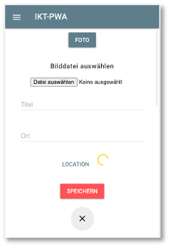

# Gerätezugriffe

Nun wollen wir noch auf Geräteschnittstellen zugreifen. Dazu gehören die Kamera und auch die Geolocation-API, um unseren Standort zu ermitteln. Früher war JavaScript eine "SandBox", d.h. JavaScript-Code war vollständig innerhalb des Browsers gekapselt und hatte keinerlei Zugriff nach außen. Das änderte sich mit dem `Upload File`-Button. JavaScript bekam (sehr eingeschränkten) Zugriff auf das Dateisystem (nur lesend). In der Zwischenzeit hat sich das komplett gewandelt. JavaScript läuft erstens auch auf Servern und hat zweitens über eine Vielzahl von APIs Zugriff auf unterschiedlichste Schnittstellen zum System. Wir wollen hier betrachten, wie JavaScript auf Kamera und den Standort zugreifen kann. 


## Anpassung der Anwendung

Ausgangspunkt ist [dieser Stand des Projektes](./files/IKT-PWA-07.zip), den wir nach dem Einfügen von [Push-Notifications](../pushnotes/#push-notifications) erreicht haben. Wir wollen nun die Kamera verwenden, um Bilder aufzunehmen, dazu erweiteren wir die Anwendung zunächst, um neben `title` und `location` auch noch ein drittes EIngabefeld für die Bilder zu erhalten. 

Dazu erweiteren wir zunächst die `public/index.html`: 


=== "public/index.html"
	```html linenums="65" hl_lines="2-9 18-21"
    <div id="create-post">
        <video id="player" autoplay></video>
        <canvas id="canvas" width="320px" height="240px"></canvas>
        <button class="mdl-button mdl-js-button mdl-button--raised mdl-button--colored" id="capture-btn">Foto</button>
        <div id="pick-image">
            <h6>Bild auswählen</h6>
            <input type="file" accept="image/*" id="image-picker">
        </div>
    	<form>
            <div class="input-section mdl-textfield mdl-js-textfield mdl-textfield--floating-label">
                <input class="mdl-textfield__input" type="text" id="title">
                <label class="mdl-textfield__label" for="title" name="title">Titel</label>
            </div>
            <div class="input-section mdl-textfield mdl-js-textfield mdl-textfield--floating-label" id="manual-location">
                <input class="mdl-textfield__input" type="text" id="location">
                <label class="mdl-textfield__label" for="location" name="location">Ort</label>
            </div>
            <div class="input-section">
                <button class="mdl-button mdl-js-button mdl-button--colored" type="button" id="location-btn">Location</button>
                <div class="mdl-spinner mdl-js-spinner is-active" id="location-loader"></div>
            </div>
            <br>
            <div>
                <button class="mdl-button mdl-js-button mdl-button--raised mdl-button--colored mdl-color--accent" type="submit" id="post-btn">Speichern
                </button>
            </div>
            <br>
            <div>
                <button class="mdl-button mdl-js-button mdl-button--fab" id="close-create-post-modal-btn" type="button">
                    <i class="material-icons">close</i>
                </button>
            </div>
        </form>
    </div>
	```

Das `<video>`- (Zeile `2`) und das `<cabvas>`-Element (Zeile `3`) werden verwendet, um mit der Kamera Bilder aufzunehmen, die mit dem `<button>` (Zeile `3`) gespeichert werden. Der `file-picker` (Zeilen `7-9`) wird benötigt, falls das Gerät über keine Kamera (oder keinen Kamerazugriff) verfügt. Außerdem fügen wir noch eine weitere Eingabesection für die `Location` hinzu mit einem Button und einem `spinner`, der anzeigen soll, dass etwas passiert. 

Wir verwenden die CSS-Klassen und -Ids auch noch, um die Eingabe etwas "schöner" aussehen zu lassen und erweiteren dazu die `feed.css`:


=== "public/src/css/feed.css"
	```css linenums="1" hl_lines="5 16-21 23-25 27-29 31-33"
	#create-post {
	    z-index: 1001;
	    position: fixed;
	    width: 100%;
	    min-height: calc(100vh - 56px);
	    overflow-y: scroll;
	    bottom: 0;
	    top: 56px;
	    background: white;
	    text-align: center;
	    /* visibility: hidden; */
	    transform: translateY(100vH);
	    transition: transform 0.3s;
	}

	#create-post video, #create-post canvas {
	    width: 512px;
	    max-width: 100%;
	    display: none;
	    margin: auto;
	}

	#create-post #pick-image {
	    display: none;
	}

	#create-post #capture-btn {
	    margin: 10px auto;
	}

	.mdl-spinner {
	    margin: auto;
	}

	/* hier der Rest */
	```

Die CSS-Definitionen sorgen insbesondere dafür, dass das Video- , Canvas- und File-Picker-Element zunächst versteckt ist. 

## DOM-Zugriff

Wir wollen uns zunächst darum kümmern, ein Live-Bild der Kamera in das Canvas-Element zu integrieren, d.h. wir kümmern uns zunächst um den Kamerazugriff. 

### Kamera

Für den Kamerazugriff benötigen wir etwas JavaScript-Code. Wir erweitern die `feed.js`. Zunächst vereinfachen wir die Zugriffe auf die einzelnen Elemente und fügen eine Funktion hinzu, mit der wir den Zugriff auf die Kamera prüfen und herstellen wollen:


=== "public/src/js/feed.js"
	```js linenums="1" hl_lines="8-12 14-16 20"
	let shareImageButton = document.querySelector('#share-image-button');
	let createPostArea = document.querySelector('#create-post');
	let closeCreatePostModalButton = document.querySelector('#close-create-post-modal-btn');
	let sharedMomentsArea = document.querySelector('#shared-moments');
	let form = document.querySelector('form');
	let titleInput = document.querySelector('#title');
	let locationInput = document.querySelector('#location');
	let videoPlayer = document.querySelector('#player');
	let canvasElement = document.querySelector('#canvas');
	let captureButton = document.querySelector('#capture-btn');
	let imagePicker = document.querySelector('#image-picker');
	let imagePickerArea = document.querySelector('#pick-image');

	function initializeMedia() {

	}

	function openCreatePostModal() {
	    createPostArea.style.transform = 'translateY(0)';
	    initializeMedia();
	}
	```

In der neuen Funktion `initializeMedia()` wollen wir die [MediaDevices](https://developer.mozilla.org/en-US/docs/Web/API/MediaDevices)-API verwenden. Ein Blick in die [Dokumentation](https://developer.mozilla.org/en-US/docs/Web/API/MediaDevices) dieser API zeigt, dass die Browser-Unterstützung noch nicht besonders gut ist, zumindest für einige der Methoden darin. Wir wollen aber insbesondere die `getUserMedia()`-Funktion verwenden und dafür ist die Browser-Unterstützung wiederum doch [sehr gut](https://developer.mozilla.org/en-US/docs/Web/API/MediaDevices/getUserMedia) (Chrom, Firefox, Edge und alle mobilen Geräte). 

Für den Fall, dass die `MediaDevices`-API nicht unterstützt werden, erstellen wir uns im `navigator` ein eigenes `mediaDevices`-Objekt und prüfen, ob die `getUserMedia()`-Funktion unterstützt wird. Wenn dies nicht der Fall ist, erstellen wir uns für das neue `mediaDevices`-Objekt eine neue Eigenschaft `getUserDevices` und definieren es als eine Funktion. Diese Funktion nutzt dann *alte* Funktionen, die in den jeweiligen Browsern angeboten wurden (und werden). Wie gesagt, das ist nur ein *Fallback* für den Fall, dass ein Browser verwendet wird, der die `getUserMedia()`-Funktion in der `MediaDevices`-API **nicht** unterstützt (was, wie wir oben erläutert haben, nur noch selten der Fall ist). Wir erweitern für diesen seltenen Fall die `initializeMedia()`-Funktion:  


=== "public/src/js/feed.js"
	```js linenums="14"
	function initializeMedia() {
	    if(!('mediaDevices' in navigator)) {
	        navigator.mediaDevices = {};
	    }

	    if(!('getUserMedia' in navigator.mediaDevices)) {
	        navigator.mediaDevices.getUserMedia = function(constraints) {
	            let getUserMedia = navigator.webkitGetUserMedia || navigator.mozGetUserMedia;

	            if(!getUserMedia) {
	                return Promise.reject(new Error('getUserMedia is not implemented'));
	            }

	            return new Promise( (resolve, reject) => {
	                getUserMedia.call(navigator, constraints, resolve, reject);
	            })
	        }
	    }
	}
	```

Wenn also die `MediaDevices`-API nicht unterstützt wird (Zeile `15`), dann erstellen wir einen eigenes `MediaDevices`-Objekt (Zeile `16`). Für dieses eigene `MediaDevices`-Objekt erstellen wir eine `getUserMedia()`-Funktion (Zeile `20`). Diese Funktion gibt eine `Promise` zurück. Entweder, eine Promise mit dem Zustand `rejected` (Zeile `24`), nämlich genau dann, wenn der Browser auch nicht die *alten* Funktionen `webkitUserMedia` und `mozGetUserMedia` unterstützt. Dann können wir wirklich nichts mehr machen. Oder die Promise verwendet eine der beiden Funktionen und gibt die Promise nach Anwendung zurück - kann natürlich trotzdem noch sein, dass sie `rejected` wird, aber vielleicht auch `resolved`. Jedenfalls bezieht sich dieser gesamte Code auf den Fall, dass `getUserMedia()` in `navigator.mediaDevices` nicht unterstützt wird. Es handelt sich bei diesem Code um ein sogenanntes [Polyfill](https://developer.mozilla.org/de/docs/Glossary/Polyfill).

Wir kümmern uns jetzt darum, tatsächlich Zugriff zur Kamera zu bekommen. Das kann nun entweder über die *moderne* `getUserMedia()`-Funktion aus `navigator.mediaDevices` geschehen oder über das *Polyfill* unter Verwendung von `webkitGetUserMedia()` oder `mozGetUserMedia()`. Nur für den Fall, dass wir keinen Zugriff auf die Kamera erhalten, wollen wir den `File-Picker` verwenden, um eine Bilddatei hochzuladen. 


=== "public/src/js/feed.js"
	```js linenums="14" hl_lines="20-27"
	function initializeMedia() {
	    if(!('mediaDevices' in navigator)) {
	        navigator.mediaDevices = {};
	    }

	    if(!('getUserMedia' in navigator.mediaDevices)) {
	        navigator.mediaDevices.getUserMedia = function(constraints) {
	            let getUserMedia = navigator.webkitGetUserMedia || navigator.mozGetUserMedia;

	            if(!getUserMedia) {
	                return Promise.reject(new Error('getUserMedia is not implemented'));
	            }

	            return new Promise( (resolve, reject) => {
	                getUserMedia.call(navigator, constraints, resolve, reject);
	            })
	        }
	    }

	    navigator.mediaDevices.getUserMedia({video: true})
	        .then( stream => {
	            videoPlayer.srcObject = stream;
	            videoPlayer.style.display = 'block';
	        })
	        .catch( err => {
	            imagePickerArea.style.display = 'block';
	        });
	}
	```


An Zeile `32` können wir auf jeden Fall auf die `getUserMedia()`-Funktion zugreifen und genau das tun wir auch in Zeile `33`. Dieser Funktion wird ein JavaScript-Objekt übergeben. Dieses Objekt hat zwei Eigenschaften: `video` und `audio`. Beide sind auf `false` gesetzt, wir können sie jedoch mit `true` einschalten und erledigen das für `video` ebefalls in Zeile `33`. Diese Funktion gibt eine `promise` zurück. Im `resolve`-Fall erhalten wir einen Video- und/oder Audio-`Stream`. Wir verwenden diesen `stream` als Quelle für unseren Videplayer (der aufgrund der Funktion `autoplay` den Stream sofort anzeigt). Wir setzen dafür den Videoplayer auf sichtbar - `display: 'block'`. 

Der `reject`-Fall der Promise kann verschiedene Gründe haben. Ein Grund wäre, wie oben erläutert, dass wir selbst mit dem *Polyfill* keinen Zugriff auf die Kamera bekommen. Ein anderer wäre, dass unser Gerät gar nicht mit einer Kamera verbunden ist und ein dritter Fall wäre, dass der Zugriff auf die Kamera von der Nutzerin blockiert wird. Wenn die `getUserMedia()`-Funktion das erste Mal aufgerufen wird, erfolgt eine Abfrage, ob der Zugriff auf die Kamera zugelassen oder blockiert wird:


Die Entscheidung lässt sich auch nachträglich ändern, indem man auf das `i` links neben der URL klickt. Wenn Sie die Anwendung ausführen und den Zugriff auf die Kamera erlauben, wird das Video sofort angezeigt.


Wird die Promise `rejected`, soll die gesamte `imagePickerArea` (wieder) auf `display: 'block'` gesetzt werden. In der Funktion `closeCreatePostModal()` setzen wir die Video- und File-Picker-Elemente ebenaflls alle (wieder) auf `display: 'block'`. 


=== "public/src/js/feed.js"
	```js linenums="48" hl_lines="3-5"
	function closeCreatePostModal() {
	    createPostArea.style.transform = 'translateY(100vH)';
	    imagePickerArea.style.display = 'none';
	    videoPlayer.style.display = 'none';
	    canvasElement.style.display = 'none';
	}
	```

Wird der Zugriff auf die Kamera blockiert, wird stattdessen der File-Picker angezeigt: 





Nun wollen wir den `Foto`-Button implementieren, damit wir ein Foto von dem Kamerastream erzeugen können. Dazu implementieren wir für diesen Button die Behandlung des `click`-Ereignisses:


=== "public/src/js/feed.js"
	```js linenums="43" 
	captureButton.addEventListener('click', event => {
	    canvasElement.style.display = 'block';
	    videoPlayer.style.display = 'none';
	    captureButton.style.display = 'none';
	    let context = canvasElement.getContext('2d');
	    context.drawImage(videoPlayer, 0, 0, canvas.width, videoPlayer.videoHeight / (videoPlayer.videoWidth / canvas.width));
	    videoPlayer.srcObject.getVideoTracks().forEach( track => {
	        track.stop();
	    })
	});
	```

Die Grundidee dabei ist die, dass wir das ktuelle Bild des `videoPlayers` in unser `canvasElement` einfügen, das `canvasElement` sichtbar gestalten, den `videoPlayer` unsichtbar (und den Button dann auch gleich noch) und außerdem den Videoplayer stoppen. 

Das `Canvas`-Element verfügt über einen Grafikkontext, den wir in Zeile `52` als `2d` auswählen. Siehe dazu auch [HTMLCanvasElement.getContext()](https://developer.mozilla.org/en-US/docs/Web/API/HTMLCanvasElement/getContext). Für diesen `context` rufen wir die `drawImage()`-Funktion auf (siehe [CanvasRenderingContext2D.drawImage()](https://developer.mozilla.org/en-US/docs/Web/API/CanvasRenderingContext2D/drawImage)). 

- der erste Parameter der `drawImage()`-Funktion ist das Bild. Wir übergeben dazu den `videoPlayer`. 
- der zweite und dritte Parameter ist die Koordinate des linken oberen Punktes innerhalb des Canvas-Elementes, hier `x=0` und `y= 0`.
- der dritte Parameter gibt die Breite des Bildes an. Wir nehmen hier die gesamte Breite des Canvas-Elementes.
- der vierte Parameter gibt die Höhe des Bildes an. Da wir der Breite einen festen Wert zugewiesen haben (die Canvas-Breite), müssen wir die Höhe in Abhängigkeit der Relation des Videos berechnen. 

Wenn wir dieses Bild erstellt haben, können wir den Videoplayer stoppen. Die Funktion `getVideoTracks()` gibt ein Array allerlaufenden Streams auf der Webseite zurück. Wir laufen durch dieses Array mithilfe der `forEach`-Schleife (Zeile `54`) und stoppen alle laufenden Streams (Zeile `55`). 

Wenn wir nun den `Foto`-Button klicken, sehen wir das (Stand-)Bild im `canvasElement`, der `videoPlayer` und der Button sind unsichtbar und der `videoPlayer` ist gestoppt. 

### Speichern des Bildes im Backend

Das so aufgenommene Foto wollen wir nun im Backend speichern. Dafür ist im Backend zum Glück schon alles vorbereitet. Das Bild ist jetzt im Canvas, wir müssen es noch in einen ``base64String` umwandeln. Wir definieren uns zwei neue Funktionen. Die eine wandelt das Bild in das `blob`-Format um. Das könnte man auch schon in die Datenbank speichern, aber wir haben das Backend so geschrieben, dass es einen `base64String` erwartet. Deswegen wandeln wir das `blob`-Format auch noch in diesen `base64String` um. Wir verwenden dazu jeweils Funktionen, die man im Netz findet. Ich habe diese jetzt zusammen mit der `urlBase64ToUint8Array(base64String)`-Funktion aus dem vorherigen Kapitel in eine eigene `utility.js`-Datei gepackt, um die Funktionen etwas besser zu strukturieren. Hier die neue Datei mit den neuen Funktion `dataURItoBlob(dataURI)` und `blobToBase64` und der alten `urlBase64ToUint8Array(base64String)`, die ich aus `app.js` entfernt und **hierher verschoben** habe. 


=== "public/src/js/utility.js"
	```js linenums="1" 
	function urlBase64ToUint8Array(base64String) {
	  var padding = '='.repeat((4 - base64String.length % 4) % 4);
	  var base64 = (base64String + padding)
	      .replace(/\-/g, '+')
	      .replace(/_/g, '/');

	  var rawData = window.atob(base64);
	  var outputArray = new Uint8Array(rawData.length);

	  for (var i = 0; i < rawData.length; ++i) {
	    outputArray[i] = rawData.charCodeAt(i);
	  }
	  return outputArray;
	}

	function dataURItoBlob(dataURI) {
	  var byteString = atob(dataURI.split(',')[1]);
	  var mimeString = dataURI.split(',')[0].split(':')[1].split(';')[0]
	  var ab = new ArrayBuffer(byteString.length);
	  var ia = new Uint8Array(ab);
	  for (var i = 0; i < byteString.length; i++) {
	    ia[i] = byteString.charCodeAt(i);
	  }
	  var blob = new Blob([ab], {type: mimeString});
	  return blob;
	}


	const blobToBase64 = blob => {
	  const reader = new FileReader();
	  reader.readAsDataURL(blob);
	  return new Promise(resolve => {
	    reader.onloadend = () => {
	      resolve(reader.result);
	    };
	  });
	};
	```

Die `blobToBase64` ist als Promise definiert. Die neue Datei `utility.js` muss nun in die `index.html` eingebettet werden:


=== "public/index.html"
	```html linenums="117" hl_lines="4"
    <script defer src="/src/js/material.min.js"></script>
    <script src="/src/js/idb.js"></script>
    <script src="/src/js/db.js"></script>
    <script src="/src/js/utility.js"></script>
    <script src="/src/js/app.js"></script>
    <script src="/src/js/feed.js"></script>
	```

Mit diesen Hilfsfunktionen sind die Anpassungen recht logisch, die wir nun vornehmen müssen, um die Daten in das Backend zu speichern. 

In der `feed.js` erstellen wir uns für den `base64String` eine globale Variable und weisen dieser den entsprechenden Wert zu, sobald wir das Foto aufgemommen haben: 


=== "public/src/js/feed.js"
	```js linenums="1" hl_lines="13 53-61 148 179"
	let shareImageButton = document.querySelector('#share-image-button');
	let createPostArea = document.querySelector('#create-post');
	let closeCreatePostModalButton = document.querySelector('#close-create-post-modal-btn');
	let sharedMomentsArea = document.querySelector('#shared-moments');
	let form = document.querySelector('form');
	let titleInput = document.querySelector('#title');
	let locationInput = document.querySelector('#location');
	let videoPlayer = document.querySelector('#player');
	let canvasElement = document.querySelector('#canvas');
	let captureButton = document.querySelector('#capture-btn');
	let imagePicker = document.querySelector('#image-picker');
	let imagePickerArea = document.querySelector('#pick-image');
	let base64String = '';

	function initializeMedia() {
	    if(!('mediaDevices' in navigator)) {
	        navigator.mediaDevices = {};
	    }

	    if(!('getUserMedia' in navigator.mediaDevices)) {
	        navigator.mediaDevices.getUserMedia = function(constraints) {
	            let getUserMedia = navigator.webkitGetUserMedia || navigator.mozGetUserMedia;

	            if(!getUserMedia) {
	                return Promise.reject(new Error('getUserMedia is not implemented'));
	            }

	            return new Promise( (resolve, reject) => {
	                getUserMedia.call(navigator, constraints, resolve, reject);
	            })
	        }
	    }

	    navigator.mediaDevices.getUserMedia({video: true})
	        .then( stream => {
	            videoPlayer.srcObject = stream;
	            videoPlayer.style.display = 'block';
	        })
	        .catch( err => {
	            imagePickerArea.style.display = 'block';
	        });
	}

	captureButton.addEventListener('click', event => {
	    canvasElement.style.display = 'block';
	    videoPlayer.style.display = 'none';
	    captureButton.style.display = 'none';
	    let context = canvasElement.getContext('2d');
	    context.drawImage(videoPlayer, 0, 0, canvas.width, videoPlayer.videoHeight / (videoPlayer.videoWidth / canvas.width));
	    videoPlayer.srcObject.getVideoTracks().forEach( track => {
	        track.stop();
	    });
	    let picture = dataURItoBlob(canvasElement.toDataURL());
	    console.log('picture', picture);
	    blobToBase64(picture)
	        .then( res => {
	            let base64StringWithTag = res;
	            base64String = base64StringWithTag.substr(base64StringWithTag.indexOf(',')+1)
	            console.log('base64String', base64String);
	            }
	        )
	});

	function openCreatePostModal() {
	    createPostArea.style.transform = 'translateY(0)';
	    initializeMedia();
	}

	function closeCreatePostModal() {
	    createPostArea.style.transform = 'translateY(100vH)';
	    imagePickerArea.style.display = 'none';
	    videoPlayer.style.display = 'none';
	    canvasElement.style.display = 'none';
	}

	shareImageButton.addEventListener('click', openCreatePostModal);

	closeCreatePostModalButton.addEventListener('click', closeCreatePostModal);

	function clearCards() {
	    while (sharedMomentsArea.hasChildNodes()) {
	        sharedMomentsArea.removeChild(sharedMomentsArea.lastChild);
	    }
	}

	function createCard(data) {
	    let cardWrapper = document.createElement('div');
	    cardWrapper.className = 'shared-moment-card mdl-card mdl-shadow--2dp';
	    let cardTitle = document.createElement('div');
	    cardTitle.className = 'mdl-card__title';
	    let image = new Image();
	    image.src = "data:image/png;base64," + data.image;
	    cardTitle.style.backgroundImage = 'url(' + image.src + ')';
	    cardTitle.style.backgroundSize = 'cover';
	    cardWrapper.appendChild(cardTitle);
	    let cardTitleTextElement = document.createElement('h2');
	    cardTitleTextElement.className = 'mdl-card__title-text whiteText';
	    cardTitleTextElement.textContent = data.title;
	    cardTitle.appendChild(cardTitleTextElement);
	    let cardSupportingText = document.createElement('div');
	    cardSupportingText.className = 'mdl-card__supporting-text';
	    cardSupportingText.textContent = data.location;
	    cardSupportingText.style.textAlign = 'center';
	    cardWrapper.appendChild(cardSupportingText);
	    componentHandler.upgradeElement(cardWrapper);
	    sharedMomentsArea.appendChild(cardWrapper);
	}

	function updateUI(data) {
	    for (let post of data) {
	        createCard(post);
	    }
	}

	let networkDataReceived = false;

	fetch('http://localhost:3000/posts')
	    .then((res) => {
	        return res.json();
	    })
	    .then((data) => {
	        networkDataReceived = true;
	        console.log('From backend ...', data);
	        updateUI(data);
	    });

	if ('indexedDB' in window) {
	    readAllData('posts')
	        .then(data => {
	            if (!networkDataReceived) {
	                console.log('From cache ...', data);
	                updateUI(data);
	            }
	        })
	}

	function sendDataToBackend() {
	    fetch('http://localhost:3000/posts', {
	        method: 'POST',
	        headers: {
	            'Content-Type': 'application/json',
	            'Accept': 'application/json',
	        },
	        body: JSON.stringify({
	            id: null,
	            title: titleInput.value,
	            location: locationInput.value,
	            image: base64String,
	            })
	    })
	    .then( response => {
	        console.log('Data sent to backend ...', response);
	        return response.json();
	    })
	    .then( data => {
	        console.log('data ...', data);
	        updateUI(Object.entries(data));
	    });
	}


	form.addEventListener('submit', event => {
	    event.preventDefault(); // nicht absenden und neu laden
	    console.log(' in submit !');
	    if (titleInput.value.trim() === '' || locationInput.value.trim() === '') {
	        alert('Bitte Titel und Location angeben!')
	        return;
	    }

	    closeCreatePostModal();

	    if('serviceWorker' in navigator && 'SyncManager' in window) {
	        navigator.serviceWorker.ready
	            .then( sw => {
	                let post = {
	                    id: new Date().toISOString(),
	                    title: titleInput.value,
	                    location: locationInput.value,
	                    image: base64String
	                };
	                writeData('sync-posts', post)
	                    .then( () => {
	                        return sw.sync.register('sync-new-post');
	                    })
	                    .then( () => {
	                        let snackbarContainer = new MaterialSnackbar(document.querySelector('#confirmation-toast'));
	                        let data = { message: 'Eingaben zum Synchronisieren gespeichert!', timeout: 1000};
	                        snackbarContainer.showSnackbar(data);
	                    });
	            });
	    } else {
	        sendDataToBackend();
	    }
	});
	```

In Zeile `13` ist die Deklaration der globalen Variablen. In den Zeilen `53-61` wird das Bild in einen `base64String` umgewandelt (unter Verwendung der neuen Funktionen aus der `utility.js`). Für das Senden der Daten an das Backend wird nun für die `image`-Eigenschaft der Wert aus der globalen Variablen gelesen und das Gleiche passiert, wenn wir das Bild in die IndexedDB speichern, um es per Hintergrundsynchronisation an das Backend zu senden. 

Bei der Behandlung des `sync`-Events im Service Worker lesen wir nun auch diesen Wert für die `image`-Eigenschaft aus: 


=== "public/sw.js"
	```js linenums="104" hl_lines="20"
	self.addEventListener('sync', event => {
	    console.log('service worker --> background syncing ...', event);
	    if(event.tag === 'sync-new-post') {
	        console.log('service worker --> syncing new posts ...');
	        event.waitUntil(
	            readAllData('sync-posts')
	                .then( dataArray => {
	                    for(let data of dataArray) {
	                        console.log('data from IndexedDB', data);
	                        fetch('http://localhost:3000/posts', {
	                            method: 'POST',
	                            headers: {
	                                'Content-Type': 'application/json',
	                                'Accept': 'application/json',
	                            },
	                            body: JSON.stringify({
	                                id: null,
	                                title: data.title,
	                                location: data.location,
	                                image: data.image,
	                            })
	                        })
	                        .then( response => {
	                            console.log('Data sent to backend ...', response);
	                            if(response.ok) {
	                                deleteOneData('sync-posts', data.id)
	                            }
	                        })
	                        .catch( err => {
	                            console.log('Error while sending data to backend ...', err);
	                        })
	                    }
	                })
	        );
	    }
	})
	```

Das war es schon, wir können nun die Daten an das Backend senden. Zum Testen nehmen Sie ein Foto auf, geben einen Titel und eine Location ein und klicken den `Speichern`-Button. Dann lednet - hoffentlich - alles im Backend (über den "Umweg" IndexedDB natürlich). Sie erhalten auch eine Push-Nachricht, dass die Daten gespeichert wurden. 

Wir implementieren nun noch den Fall, dass die Kamera nicht zur Verfügung steht oder die `MediaDevices`-API oder der Kamerazugriff blockiert wurde und ermöglichen dafür das Hochladen einer Bilddatei. 

### Bilddatei hochladen

Das Hochladen einer Bilddatei kennen wir ja bereits von unserem anderen Frontend. Hier ist nun auch schon alles vorbereitet und wir müssen in der `feed.js` nur noch das `change`-Event für den `upload`-Button behandeln. Das sieht im Prinzip genau so aus, wie die Umwandlung des Canvas-Bildes, nur dass `picture` hier die hochgeladene Datei ist: 


=== "public/src/js/feed.js"
	```js linenums="104" hl_lines="20"
	imagePicker.addEventListener('change', event => {
	    let picture = event.target.files[0];
	    blobToBase64(picture)
	        .then( res => {
	                let base64StringWithTag = res;
	                base64String = base64StringWithTag.substr(base64StringWithTag.indexOf(',')+1)
	                console.log('base64String', base64String);
	            }
	        )
	});
	```

Zum Testen muss im Browser links von der URL auf das `i` geklickt und Kamera `blockieren` ausgewählt werden. dann öffnet sich der File-Picker. 

## Geolocation-API

Die Geolocation-API wird von allen Browsern unterstützt (sogar Internet Explorer). Es gibt viele Dokumentationen darüber, z.B. [hier](https://developer.mozilla.org/en-US/docs/Web/API/Geolocation), [hier](https://developer.mozilla.org/de/docs/Web/API/Geolocation_API) und [hier](https://developers.google.com/maps/documentation/geolocation/overview). Die Verwendung ist recht einfach. 

In der `index.html` haben wir uns bereits einen Button erstellt, für den wir "nur noch" das `click`-Ereignis behandeln müssen. 


=== "public/index.html"
	```html linenums="83"
    <div class="input-section">
        <button class="mdl-button mdl-js-button mdl-button--colored" type="button" id="location-btn">Location</button>
        <div class="mdl-spinner mdl-js-spinner is-active" id="location-loader"></div>
    </div>
	```

Zunächst vereinfachen wir uns in der `feed.js` wieder den Zugriff auf den Button und den Spinner (Loader) und erstellen noch eine globale Variable `fetchedLocation`:


=== "public/src/js/feed.js"
	```js linenums="1" hl_lines="14-16"
	let shareImageButton = document.querySelector('#share-image-button');
	let createPostArea = document.querySelector('#create-post');
	let closeCreatePostModalButton = document.querySelector('#close-create-post-modal-btn');
	let sharedMomentsArea = document.querySelector('#shared-moments');
	let form = document.querySelector('form');
	let titleInput = document.querySelector('#title');
	let locationInput = document.querySelector('#location');
	let videoPlayer = document.querySelector('#player');
	let canvasElement = document.querySelector('#canvas');
	let captureButton = document.querySelector('#capture-btn');
	let imagePicker = document.querySelector('#image-picker');
	let imagePickerArea = document.querySelector('#pick-image');
	let base64String = '';
	let locationButton = document.querySelector('#location-btn');
	let locationLoader = document.querySelector('#location-loader');
	let fetchedLocation;

	```

und wir setzen den `Loader` in der `feed.css` auf unsichtbar:


=== "public/src/js/feed.css"
	```css linenums="23" hl_lines="1"
	#create-post #pick-image, #create-post #location-loader {
	    display: none;
	}
	```

`create-post #pick-image` stand dort schon, wir haben nur noch den Selektor `#create-post #location-loader` hinzugefügt.


Wir fügen in der `feed.js` die Behandlung des `click`-Ereignisses für den `Location`-Button hinzu und auch noch, wie für die Kamera, eine `initializeLocation()`-Funktion, in der geprüft wird, ob die `Geolocation`-API überhaupt im Browser verfügbar ist: 


=== "public/src/js/feed.js"
	```js linenums="18"
	locationButton.addEventListener('click', event => {
	    if(!('geolocation' in navigator)) {
	        return;
	    }

	    locationButton.style.display = 'none';
	    locationLoader.style.display = 'block';

	    navigator.geolocation.getCurrentPosition( position => {
	        locationButton.style.display = 'inline';
	        locationLoader.style.display = 'none';
	        fetchedLocation = { latitude: position.coords.latitude, longitude: position.coords.longitude };
	        console.log('current position: ', fetchedLocation);
	        locationInput.value = 'In Berlin';
	        document.querySelector('#manual-location').classList.add('is-focused');
	    }, err => {
	        console.log(err);
	        locationButton.style.display = 'inline';
	        locationLoader.style.display = 'none';
	        alert('Couldn\'t fetch location, please enter manually!');
	        fetchedLocation = null;
	    }, { timeout: 5000});
	});

	function initializeLocation() {
	    if(!('geolocation' in navigator)) {
	        locationButton.style.display = 'none';
	    }
	}
	```

In der `initializeLocation()`-Funktion wird geprüft, ob der Browser die `Geolocation`-API unterstützt. Wenn nicht, wird der `Location`-Button versteckt. Wir haben trotzdem, sicherheitshalber, die Abfrage nochmal in die Behandlung des `click`-Ereignisses für diesen Button eingefügt (Zeilen `19-20`), obwohl dies nicht wirklich notwendig ist, da der Button nicht angeklickt werden kann, wenn die `Geolocation`-API nicht unterstützt wird, da er nicht angezeigt wird. 

Wenn auf den Button geklickt wurde, setzen wir den Button selbst auf unsichtbar (Zeile `23`) und den Spinner (Loader) auf sichtbar (Zeile `24`). Zeile `26` zeigt den eigentlichen Zugriff auf die aktuelle Position. Dort wird die Funktion `getCurrentPosition()` der `Geolocation`-API aufgerufen. Wir übergeben drei Parameter:

- der erste Parameter ist die (Callback-)Funktion, die die aktuelle Position zurückgibt. Wenn diese Funktion ausgeführt wird, setzen wir den Button wieder auf sichtbar (Zeile `27`) und den Loader auf unsichtbar (Zeile `28`). Die aktuelle Position `position` enthält die Eigenschaft `coords`, die die `latitude` und `longitude` als Werte enthält (siehe [GeolocationPosition](https://developer.mozilla.org/en-US/docs/Web/API/GeolocationPosition) und [GeolocationPosition](https://developer.mozilla.org/en-US/docs/Web/API/GeolocationCoordinates)).  Diese Position geben wir auf der Konsole aus (Zeile `30`). Wir befüllen das `locationInput`-Eingabefeld noch mit einem Dummy-Wert und fokussieren auf das Eingabefeld (Zeilen `31-32`).
- der zweite Parameter ist eine Funktion, die ausgeführt wird, wenn ein Fehler auftritt. Mögliche Fehler sind, dass im Browser der Zugriff auf die Position deaktiviert wurde, dass die Nutzerin den Zugriff auf die aktuelle Position blockiert hat oder dass die Position nicht "schnell genug" ermittelt werden konnte. Im Fehlerfall geben wir den Fehler auf der Konsole aus und schalten den Button wieder ein und den Loader wieder aus (Zeilen `34-36`).
- der dritte Parameter ist ein JavaScript-Objekt mit `options`. Wir wählen hier nur eine einzige Option, nämlich wie lange nach der aktuellen Position gesucht werden soll. In der Einstellung erfolgt der `timeout` nach `5 sek`. 

Wir passen nun in der `feed.js` noch die beiden Funktionen `openCreatePostModal()` und `closeCreatePostModal()` an:


=== "public/src/js/feed.js"
	```js linenums="109" hl_lines="4 12-13"
	function openCreatePostModal() {
	    createPostArea.style.transform = 'translateY(0)';
	    initializeMedia();
	    initializeLocation();
	}

	function closeCreatePostModal() {
	    createPostArea.style.transform = 'translateY(100vH)';
	    imagePickerArea.style.display = 'none';
	    videoPlayer.style.display = 'none';
	    canvasElement.style.display = 'none';
	    locationButton.style.display = 'inline';
	    locationLoader.style.display = 'none';
	}
	```


Wenn Sie die Anwenung nun starten, werden Sie gefragt, ob Sie die Abfrage nach Ihrem Standort zulassen oder blockieren wollen. Die meisten von Ihnen werden aber die **Ortungsdienste ausgeschaltet** haben. Dann ist auch die Abfrage zunächst egal. Im Mac kann man diese (kurzzeitig, dann wieder ausschalten) über `Systemeinstellungen --> Sicherheit & Datenschutz --> Reiter Datenschutz --> Ortungsdienste` für `Google Chrome` aktivieren. 

Wenn Sie die Positionsbestimmung zulassen, dann wird nach dem Klicken auf den `Location`-Button die aktuelle Position auf der Konsole eingegeben und im Formular erscheint unter Ort `In Berlin`.

Wir machen nichts weiter mit der aktuellen Position. Es gibt viele Möglichkeiten, die jetzt noch ausprobiert werden könnten. Dazu gehören besipeilsweise:

- Wir könnten mithilfe der [Google-Geolocation-API](https://developers.google.com/maps/documentation/geolocation/overview) die Adresse ermitteln, die Google für eine gegebene Position (`longitude` und `latitude`) zurückgibt. Dazu bräuchten wir aber auch einen [API-Key](https://developers.google.com/maps/documentation/geolocation/get-api-key) von Google.
- Wir könnten das Gleiche mit der [Nominatim-API](https://nominatim.org/) für Open Street Map machen. Sie können den Service [hier einmal ausprobieren](https://nominatim.openstreetmap.org/ui/reverse.html), indem Sie Ihre `latitude` und `longitude` aus der Konsolenausgabe eingeben.
- Wir könnten [OpenLayers](https://openlayers.org/en/latest/doc/quickstart.html) verwenden, um die Position auf einer Karte anzuzeigen.
- Wir könnten die Datenbank erweitern und für alle Posts auch noch die Koordinaten der Position abspeichern und dann alle Posts auf einer Karte (mithilfe von OpenLayers + OpenStreetMap) visualisieren.
- ...


### Letzte Verbesserungen

Ein Nachteil in unserer Anwendung ist noch, dass die Kamera die ganze Zeit läuft, wenn wir einmal den modalen Dialog zur Eingabe von daten geöffnet hatten. Wir sollten sie beim Ausschalten des modalen Dialoges schließen. Das Stoppen aller Videostreams hatten wir bereits für die Aufnahme des Fotos gemacht. Weil jedoch das Schließen und erneutes Öffnen der Kamera sehr ressourcenverbrauchend ist, laufen die Animationen für das Öffnen und Schließen des modalen Dialogs nicht mehr flüssig. Wir lagern diese Animationen deshalb in einen asynchronen "Thread" aus (ist nicht wirklich ein neuer Thread): 


=== "public/src/js/feed.js"
	```js linenums="109" hl_lines="2-4 15-20"
	function openCreatePostModal() {
	    setTimeout( () => {
	        createPostArea.style.transform = 'translateY(0)';
	    }, 1);
	    initializeMedia();
	    initializeLocation();
	}

	function closeCreatePostModal() {
	    imagePickerArea.style.display = 'none';
	    videoPlayer.style.display = 'none';
	    canvasElement.style.display = 'none';
	    locationButton.style.display = 'inline';
	    locationLoader.style.display = 'none';
	    if(videoPlayer.srcObject) {
	        videoPlayer.srcObject.getVideoTracks().forEach( track => track.stop());
	    }
	    setTimeout( () => {
	        createPostArea.style.transform = 'translateY(100vH)';
	    }, 1);
	}
	```

Mithilfe des `timeout`-"Tricks" wird der modale Dialog fließend geschlossen und das Kamerazeichen im Tab des Browsers schließt asynchron etwas später. 

!!! success
	Wir haben erfolgreich den Zugriff auf die Kamera (MediaDevices-API) und die Geolocation-API ausprobiert und in unsere Anwendung eingebunden. Die MediaDevices-API bietet neben der `video`-Eigenschaft auch noch die `audio`-Eigenschaft, um das Mikrofon zu verwenden. Mit dem Zugriff auf Kamera und Position haben wir unsere letzte *progressive* Funktionalität für dieses Semester hinzugefügt! Geschafft! 
