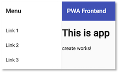

# Frontend

Um die Dateneingabe zu vereinfachen, erstellen wir uns ein einfaches Frontend mithilfe von [Angular](https://angular.io/). Wie beim Backend auch, erstellen wir dieses Frontend Schritt für Schritt von Beginn an. 

[Angular](https://angular.io/) ist ein modernes JavaScript-Framework zur Entwicklung moderner Weboberflächen. Es gehört neben [React.js](https://reactjs.org/) und [Vue.js](https://vuejs.org/) zu den meisteverwendeten Frameworks für die Entwicklung sogenannter *Single-Page-Applikationen*. Um einfacher mit `Angular` zu entwickeln zu können, benötigen wir das [Angular-Command-Line-Interface (CLI)](https://angular.io/cli). Dieses installieren wir mithilfe des Paketmanagers `npm`. Geben Sie dazu ins Terminal 

```bash
npm install -g @angular/cli
```

ein. Sie können prüfen, ob die Installation erfolgreich war, indem Sie in das Terminal 

```bash
ng --version
```

eingeben. Es sollte etwas in der Art ausgeben: 

```bash

     _                      _                 ____ _     ___
    / \   _ __   __ _ _   _| | __ _ _ __     / ___| |   |_ _|
   / △ \ | '_ \ / _` | | | | |/ _` | '__|   | |   | |    | |
  / ___ \| | | | (_| | |_| | | (_| | |      | |___| |___ | |
 /_/   \_\_| |_|\__, |\__,_|_|\__,_|_|       \____|_____|___|
                |___/
    

Angular CLI: 11.0.1
Node: 14.15.0
OS: darwin x64

Angular: 
... 
Ivy Workspace: 

Package                      Version
------------------------------------------------------
@angular-devkit/architect    0.1100.1 (cli-only)
@angular-devkit/core         11.0.1 (cli-only)
@angular-devkit/schematics   11.0.1 (cli-only)
@schematics/angular          11.0.1 (cli-only)
@schematics/update           0.1100.1 (cli-only)
    
```

#### Projekt erstellen - ng new

Um ein Angular-Projekt zu erstellen, wird der Befehl `ng new <projekt>` verwenden. Wir nennen das Projekt `frontend` und geben deshalb 

```bash
ng new frontend
```

ins Terminal ein. 

- Die Frage nach `stricter type checking` beantworten wir mit `N`, also `Enter`. Das macht unser Leben etwas leichter. Fortgeschrittene Angular-Programmiererinnen können aber auch gerne mit `y` antworten. (Die neue Angular CLI-Version 12 fragt danach nicht mehr, sondern verwendet das strikte Typesetting einfach, das macht es an einigen Stellen etwas komplizierter). 
- Die Frage nach `routing` beantworten wir mit `y`, d.h. hier wählen wir nicht die Standardantwort! `Routing` erläutern wir gleich noch. 
- Bei den Stylesheets entscheiden wir uns für `CSS`, können also einfach mit `Enter` bestätigen. 

Jetzt sollte das Projekt eigentlich fehlerfrei erstellt worden sein. Aktuell wirft die Angular CLi jedoch einen Fehler, der vielleicht bei einigen von Ihnen auch auftritt [Stackoverflow](https://stackoverflow.com/questions/67433893/unable-to-resolve-dependency-tree-error-for-creating-new-angular-project):

```bash
⠹ Installing packages (npm)...npm ERR! code ERESOLVE
npm ERR! ERESOLVE unable to resolve dependency tree
npm ERR! 
npm ERR! While resolving: frontend@0.0.0
npm ERR! Found: jasmine-core@3.6.0
npm ERR! node_modules/jasmine-core
npm ERR!   dev jasmine-core@"~3.6.0" from the root project
npm ERR! 
npm ERR! Could not resolve dependency:
npm ERR! peer jasmine-core@">=3.7.1" from karma-jasmine-html-reporter@1.6.0
npm ERR! node_modules/karma-jasmine-html-reporter
npm ERR!   dev karma-jasmine-html-reporter@"^1.5.0" from the root project
npm ERR! 
npm ERR! Fix the upstream dependency conflict, or retry
npm ERR! this command with --force, or --legacy-peer-deps
npm ERR! to accept an incorrect (and potentially broken) dependency resolution.
npm ERR! 
npm ERR! See /Users/jornfreiheit/.npm/eresolve-report.txt for a full report.

npm ERR! A complete log of this run can be found in:
npm ERR!     /Users/jornfreiheit/.npm/_logs/2021-05-28T06_28_54_229Z-debug.log
✖ Package install failed, see above.
The Schematic workflow failed. See above.
```

In dem oben gezeigten [Stackoverflow](https://stackoverflow.com/questions/67433893/unable-to-resolve-dependency-tree-error-for-creating-new-angular-project)-Post wird vorgeschlagen, in der `package.json` die Versionsnummern für 

- `"jasmine-core"` von `3.6.0` auf `3.7.1` und für 
- `"karma-jasmine-html-reporter"` von `1.5.0` auf `1.6.0` zu ändern und dann

```bash
npm install
```
im Projektordner auszuführen. Das klappt auch (klappte bei mir). Die `package.json` sieht dann also so aus:

```javascript linenums="1" hl_lines="1"
{
    "name": "frontend",
    "version": "0.0.0",
    "scripts": {
        "ng": "ng",
        "start": "ng serve",
        "build": "ng build",
        "test": "ng test",
        "lint": "ng lint",
        "e2e": "ng e2e"
    },
    "private": true,
    "dependencies": {
        "@angular/animations": "~11.0.0",
        "@angular/common": "~11.0.0",
        "@angular/compiler": "~11.0.0",
        "@angular/core": "~11.0.0",
        "@angular/forms": "~11.0.0",
        "@angular/platform-browser": "~11.0.0",
        "@angular/platform-browser-dynamic": "~11.0.0",
        "@angular/router": "~11.0.0",
        "rxjs": "~6.6.0",
        "tslib": "^2.0.0",
        "zone.js": "~0.10.2"
    },
    "devDependencies": {
        "@angular-devkit/build-angular": "~0.1100.1",
        "@angular/cli": "~11.0.1",
        "@angular/compiler-cli": "~11.0.0",
        "@types/jasmine": "~3.6.0",
        "@types/node": "^12.11.1",
        "codelyzer": "^6.0.0",
        "jasmine-core": "~3.7.1",
        "jasmine-spec-reporter": "~5.0.0",
        "karma": "~5.1.0",
        "karma-chrome-launcher": "~3.1.0",
        "karma-coverage": "~2.0.3",
        "karma-jasmine": "~4.0.0",
        "karma-jasmine-html-reporter": "^1.6.0",
        "protractor": "~7.0.0",
        "ts-node": "~8.3.0",
        "tslint": "~6.1.0",
        "typescript": "~4.0.2"
    }
}
```

Die Anweisung `npm install` im Projekte-Ordner führt dazu, dass alle Abhängigkeiten, die in der Datei `package.json` 
definiert sind, geladen und das `node_modules`-Verzeichnis erstellt. Siehe z.B. [hier](https://www.stackchief.com/tutorials/npm%20install%20%7C%20how%20it%20works). Sollten Sie aufgefordert werden, `npm audit fix` oder `npm audit fix --force` auszuführen, weil es noch `high vulnerabilities` gibt, dann führen Sie einfach 

```bash
npm audit fix --force
```
aus. Sollte auch das noch zu Fehlern führen, können Sie auch 

```bash
npm install --legacy-peer-deps
```

versuchen. Danach geben Sie

```
ng serve
```

ein. Es werden die entsprechenden TypeScript-Dateien compiliert und es erscheint am Ende eine Ausgabe, wie z.B.

```
⠋ Generating browser application bundles...****************************************************************************************
This is a simple server for use in testing or debugging Angular applications locally.
It hasn't been reviewed for security issues.

DON'T USE IT FOR PRODUCTION!
****************************************************************************************
Compiling @angular/core : es2015 as esm2015
Compiling @angular/common : es2015 as esm2015
Compiling @angular/platform-browser : es2015 as esm2015
Compiling @angular/router : es2015 as esm2015
Compiling @angular/platform-browser-dynamic : es2015 as esm2015
✔ Browser application bundle generation complete.

Initial Chunk Files | Names         |      Size
main.js             | main          | 362.07 kB
polyfills.js        | polyfills     |  44.15 kB
runtime.js          | runtime       |   1.09 kB
styles.css          | styles        |   0 bytes

                    | Initial Total | 407.31 kB

Build at: 2021-05-28T12:19:12.354Z - Hash: b1611690e9f20b1506e4 - Time: 28973ms

** Angular Live Development Server is listening on localhost:4200, open your browser on http://localhost:4200/ **


✔ Compiled successfully.
✔ Browser application bundle generation complete.

4 unchanged chunks

Build at: 2021-05-28T12:19:13.393Z - Hash: 52a9999d2b3b3c4923f4 - Time: 643ms

✔ Compiled successfully.

```
Wenn Sie aber einmal `ng serve` ausgeführt haben, wird im Browser automatisch auf die Änderungen reagiert. Sie müssen also nicht jedes Mal neu `ng serve` eingeben, bzw. nicht jedes Mal neu auf das grüne Dreieck in Ihrer IDE klicken: 

Öffnen Sie Ihren Browser und geben Sie als URL

```
http://localhost:4200
```

ein. Folgende Seite sollte erscheinen:


Öffnen Sie das Projekt in einer IDE. Die Projektstruktur ist wie folgt: 

```bash
README.md
angular.json
e2e
karma.conf.js
node_modules
package-lock.json
package.json
src
|-- app
|   |-- app-routing.module.ts
|   |-- app.component.css
|   |-- app.component.html
|   |-- app.component.spec.ts
|   |-- app.component.ts
|   |-- app.module.ts
|
|-- assets
|-- environments
|-- favicon.ico
|-- index.html
|-- main.ts
|-- polyfills.ts
|-- styles.css
|-- test.ts

tsconfig.app.json
tsconfig.json
tsconfig.spec.json
tslint.json
```


- Die meiste Arbeit wird im `src`-Ordner erledigt. Darin befindet sich (wird sich befinden) der Code unserer Anwendung.
- Darin der wichtigste Ordner ist der `app`-Ordner.
Hier werden wir unsere Module, Komponenten und Services hinzufügen.  
- In dem `assets`-Ordner werden Bilder, Icons und Daten abgelegt.
- Der `node_modules`-Ordner enthält alle benötigten
3rd-party-libraries. Welche das sind, wird in der Datei
`package.json` als *dependencies* definiert.
Mithilfe des Befehls `npm install `werden alle benötigten
Module dem Ordner `node_modules` hinzugefügt.
- Der Ordner `environments` enthält die notwendigen
Konfigurationsinformationen für den *development*- und den
*production*-Modus. Wir entwickeln zunächst im
*development*-Modus.
- `favicon.ico`ist das Favicon - ein kleines Icon, das im
Reiter erscheint. Wählen Sie am besten ein eigenes.
- `index.html` ist die Hauptseite. Mithilfe von Angular
entwickeln wir eine *Single Page Application*, d.h. es wird
eine einzige HTML-Seite geladen (`index.html`) und jeder weitere Inhalt
wird asynchron hinzugefügt.
- `styles.css` enthält die globalen Stylesheets, d.h.
die CSS-Eigenschaften, die für das gesamte Projekt gelten sollen.
- Die `app.component.*`-Dateien beschreiben die
app-Komponente. Eine Komponente besteht aus einer *HTML*-, einer
*CSS*- und einer *TypeScript*-Datei (auch noch
eine `*.spec.ts`, aber die interessiert zunächst nicht).


Öffnen Sie in Ihrer IDE die Datei `app.component.html`. Löschen
Sie den kompletten Inhalt und lassen nur noch
`<router-outlet></router-outlet>`.
Fügen Sie oberhalb von `<router-outlet></router-outlet>`
die Zeile `<h1>This is app</h1>` ein. Gehen Sie wieder zum
Browser und schauen sich den geöffneten Tab mit der URL `localhost:4200` an.
Es erscheint der folgende Inhalt:


### Single Page Application

Angular ist, wie bereits erwähnt, ein Framework zur Erstellung einer *Single Page Application (SPA)*. Das bedeutet, dass die gesamte Anwendung aus einer einzigen `HTML`-Datei besteht, der `src/index.html`-Datei und dass in diese Datei *Inhalte* asynchron eingespeist werden. Dieses Einspeisen erfolgt durch JavaScript. Die hier geladene Seite ist die `index.html`, die in unserem Projekte-Ordner `frontend` liegt. Sie sieht so aus:

=== "index.html"
  ```html
  <!doctype html>
  <html lang="en">
    <head>
      <meta charset="utf-8">
      <title>Frontend</title>
      <base href="/">
      <meta name="viewport" content="width=device-width, initial-scale=1">
      <link rel="icon" type="image/x-icon" href="favicon.ico">
    </head>
    <body>
      <app-root></app-root>
    </body>
  </html>
  ```

Das Element `<app-root>` ist dabei ein sogenannter *Tag-Selektor* (auch *Element-Selektor* oder *Komponenten-Selektor*). In Angular sind die einzelnen *Inhalte*, die eingespeist werden, *Komponenten*. Jede Anwendung hat eine Hauptkomponente - die sogenannte Root Component. Diese Hauptkomponente ist meistens die `AppComponent`. Eine Komponente hat eine in sich geschlossene Bedeutung, z.B. ein Formular für Dateneingabe, eine Liste aller Daten oder auch nur ein bestimmtes Element.

Eine Komponente besteht aus einer *View* (*Template*) und einer TypeScript-Klasse. Die `AppComponent` besteht z.B. aus der `app.component.html` (der View) und der `app.component.ts` (der TypeScript-Klasse). Die TypeScript-Klasse kümmert sich um die Verwaltung der Daten, die in der View dargestellt und/oder durch Eingaben erzeugt werden. Die TypeScript-Klasse beschreibt die *Logik* der Komponente. Die View ist der dargestellte Bereich der Komponente, also das, was man im Browser von der Komponente sieht.

Neben der `*.html`- und der `*.ts`-Datei einer Komponente gibt es auch noch die `*.css`-Datei (also z.B. `app.component.css`). Diese enthält CSS-Eigenschaften, die speziell für die Komponente gelten sollen.

Um eine Komponente der gesamten Anwendung als Komponente bekannt zu machen, wird der *Decorator* `@Component`verwendet. Decoratoren erkennt man am führenden `@`-Zeichen. Sie werden verwendet, um Metadaten der Anwendung zu verwalten. Der typische Aufbau einer Komponente (hier `AppComponent` - `app.component.ts`):

```javascript
@Component({
  selector: 'app-root',
  templateUrl: './app.component.html',
  styleUrls: ['./app.component.css']
})
export class AppComponent {
  title = 'book-app';
}
```

Der Selektor gibt an, dass überall dort, wo `app-root` als Elementselektor `<app-root> </app-root>` verwendet wird, das in `app.component.html` definerte Template eingesetzt wird. Angenommen, in `app.component.html` ist der HTML-Code:

```html
<h1>This is app</h1>
```

definiert. Dann wird dieser Code als Inhalt in das HTML-Element `<app-root> </app-root>` eingesetzt:

```html
<app-root>
  <h1>This is app</h1>
</app-root>
```

Zu dem Komponentenselektor `<router-outlet></router-outlet>` kommen wir gleich noch. Der spielt beim `Routing` eine Rolle. Wir erzeugen uns zunächst eine Navigationskomponente mithilfe von [Angular Material](https://material.angular.io/). 

### Angular Material und Schematics

[Angular Material](https://material.angular.io/) ist ein CSS- (und JavaScript)-Framework für eine Angular-Anwendung, ähnlich wie [Bootstrap](https://getbootstrap.com/docs/5.0/getting-started/introduction/). Wir verwenden hier Angular Material und fügen es mit dem Befehl 

```bash
ng add @angular/material
```

unserer Anwendung hinzu. Sie werden nach unterschiedlichen Farbkombinationen gefragt, da können Sie wählen, was Ihnen beliebt. Sie können auch alle Fragen einfach mit `Enter` beantworten und somit die Standardvorgaben übernehmen. Es erfolgt eine Ausgabe in der Art

```bash
ℹ Using package manager: npm
✔ Found compatible package version: @angular/material@12.0.2.
✔ Package information loaded.
 
The package @angular/material@12.0.2 will be installed and executed.
Would you like to proceed? Yes
✔ Package successfully installed.
? Choose a prebuilt theme name, or "custom" for a custom theme: Indigo/Pink        [ Preview: https://material.angular.io?them
e=indigo-pink ]
? Set up global Angular Material typography styles? No
? Set up browser animations for Angular Material? Yes
UPDATE package.json (1262 bytes)
✔ Packages installed successfully.
UPDATE src/app/app.module.ts (502 bytes)
UPDATE angular.json (3715 bytes)
UPDATE src/index.html (553 bytes)
UPDATE src/styles.css (181 bytes)
```

Eine nützliche Sache bei Angular Material sind [Schematics](https://material.angular.io/guide/schematics). Das sind vordefinierte Komponenten, die wir verwenden können. Wir wählen zunächst die `Navigations`-Komponente, d.h. wir erstellen mithilfe des [Navigations-Schmeas](https://material.angular.io/guide/schematics#navigation-schematic) eine neue Komponente `nav` mit dem folgenden Befehl:

```bash
ng generate @angular/material:navigation nav
```

in dem Projektordner erscheint im `/src/app`-Ordner eine neuer Ordner `nav`, der die Dateien

- `nav.component.css`, 
- `nav.component.html`, 
- `nav.component.spec.ts`, und 
- `nav.component.ts`.

enthält. Es wurde also eine neue Angular-Komponente erzeugt. Wenn wir die `nav.component.ts` öffnen, 

```js linenums="1"
import { Component } from '@angular/core';
import { BreakpointObserver, Breakpoints } from '@angular/cdk/layout';
import { Observable } from 'rxjs';
import { map, shareReplay } from 'rxjs/operators';

@Component({
  selector: 'app-nav',
  templateUrl: './nav.component.html',
  styleUrls: ['./nav.component.css']
})
export class NavComponent {

  isHandset$: Observable<boolean> = this.breakpointObserver.observe(Breakpoints.Handset)
    .pipe(
      map(result => result.matches),
      shareReplay()
    );

  constructor(private breakpointObserver: BreakpointObserver) {}

}
```

dann sehen wir in Zeile `7`, dass der Komponentenselektor dieser Komponente `app-nav` ist. Das heißt, wenn wir nun in `app.component.html` diesen Komponentenselektor einfügen, dann wird an diese Stelle die neue Komponente eingefügt:

=== "app.component.html"
    ```html linenums="1"
    <app-nav></app-nav>
    <h1>This is app</h1>
    <router-outlet></router-outlet>
    ```

Wenn man nun im Browser (nach `ng server` - falls noch nicht geschehen) `http://localhost:4200/` eingibt, dann sieht man die Navigationskomponente, aber nicht mehr die Überschrift `<h1>This is app</h1>` (und bei `<router-outlet></router-outlet>` ist derzeit eh noch nichts zu sehen). Wir nehmen diese beiden Zeilen aus der `app.component.html` heraus 

=== "app.component.html"
    ```html linenums="1"
    <app-nav></app-nav>
    ```

und fügen Sie in die `nav.component.html` ein:

=== "nav/nav.component.html"
    ```html linenums="1" hl_lines="26-27"
    <mat-sidenav-container class="sidenav-container">
      <mat-sidenav #drawer class="sidenav" fixedInViewport
          [attr.role]="(isHandset$ | async) ? 'dialog' : 'navigation'"
          [mode]="(isHandset$ | async) ? 'over' : 'side'"
          [opened]="(isHandset$ | async) === false">
        <mat-toolbar>Menu</mat-toolbar>
        <mat-nav-list>
          <a mat-list-item href="#">Link 1</a>
          <a mat-list-item href="#">Link 2</a>
          <a mat-list-item href="#">Link 3</a>
        </mat-nav-list>
      </mat-sidenav>
      <mat-sidenav-content>
        <mat-toolbar color="primary">
          <button
            type="button"
            aria-label="Toggle sidenav"
            mat-icon-button
            (click)="drawer.toggle()"
            *ngIf="isHandset$ | async">
            <mat-icon aria-label="Side nav toggle icon">menu</mat-icon>
          </button>
          <span>frontend</span>
        </mat-toolbar>
        <!-- Add Content Here -->
        <h1>This is app</h1>
        <router-outlet></router-outlet>
      </mat-sidenav-content>
    </mat-sidenav-container>
    ```

### Neue Komponente und Routing

Wir erstellen nun eine weitere Komponente und binden diese über *Routing* ein. Die neue Komponente soll `create` heißen. Wir nutzen dazu den `ng generate component <name-der-komponente>`-Befehl, der auch abgekürzt `ng g c <name-der-komponente>` werden kann.

```bash
ng g c create
```

Es entsteht ein `/src/app/create`-Ordner, der die vier Dateien `create.component.css`, `create.component.html`, `create.component.spec.ts` und `create.component.ts` enthält. In diese Komponente wollen wir später ein Formular hinzufügen, mit dessen Hilfe wir neue Daten eingeben können. 

Zunächst binden wir diese Komponente in unsere Anwendung ein. Dieses Mal erfolgt die Einbindung jedoch nicht *statisch* über den Komponentenselektor `app-create`, sondern *dynamisch* über eine *Route*. Das bedeutet, dass wenn die *Route*  `http://localhost:4200/create` in den Browser eingegeben wird, dann soll an die Stelle des *dynamischen* Komponenetenselektors `<router-outlet></router-outlet>` die `CreateComponent` eingebunden werden. dazu müssen wir die Route in der `app-routing.module.ts` definieren:


=== "app-routing.module.ts"
    ```js linenums="1" hl_lines="3 6"
    import { NgModule } from '@angular/core';
    import { Routes, RouterModule } from '@angular/router';
    import { CreateComponent } from './create/create.component';

    const routes: Routes = [
        { path: 'create', component: CreateComponent },
    ];

    @NgModule({
      imports: [RouterModule.forRoot(routes)],
      exports: [RouterModule]
    })
    export class AppRoutingModule { }
    ```

Dazu wird in dem `Routes`-Array (Zeilen `5-7`) die neue `Route` definiert, indem der `path` angegeben wird (`create`) und welche Komponente für diesen Pfad aufgerufen werden soll (`CreateComponent`). Diese Komponente wird dazu in die `app-routing.module.ts` importiert (Zeile `3`). 

Wenn wir nun in den Browser `http://localhost:4200/create` eingeben, dann wird diese Komponente in den `<routing-outlet>`-Selektor eingefügt (also unterhalb der Überschrift `<h1>This is app</h1>`). Es erscheint



, da die *View* der `CreateComponent` derzeit nur aus dem Absatz `<p>create works!</p>` besteht (siehe `create.component.html`).

Um diese Route auch über das Navigationsmenü aufrufen zu können, ändern wir unsere `nav.component.html`:

=== "nav/nav.component.html"
    ```html linenums="1" hl_lines="8"
    <mat-sidenav-container class="sidenav-container">
      <mat-sidenav #drawer class="sidenav" fixedInViewport
          [attr.role]="(isHandset$ | async) ? 'dialog' : 'navigation'"
          [mode]="(isHandset$ | async) ? 'over' : 'side'"
          [opened]="(isHandset$ | async) === false">
        <mat-toolbar>Menu</mat-toolbar>
        <mat-nav-list>
          <a mat-list-item routerLink="/create" routerLinkActive="active">Create</a>
          <a mat-list-item href="#">Link 2</a>
          <a mat-list-item href="#">Link 3</a>
        </mat-nav-list>
      </mat-sidenav>
      <mat-sidenav-content>
        <mat-toolbar color="primary">
          <button
            type="button"
            aria-label="Toggle sidenav"
            mat-icon-button
            (click)="drawer.toggle()"
            *ngIf="isHandset$ | async">
            <mat-icon aria-label="Side nav toggle icon">menu</mat-icon>
          </button>
          <span>frontend</span>
        </mat-toolbar>
        <!-- Add Content Here -->
        <h1>This is app</h1>
        <router-outlet></router-outlet>
      </mat-sidenav-content>
    </mat-sidenav-container>
    ```

*Routen* werden also nicht über `href`, sondern über `routerLink` aufgerufen (siehe [hier](https://angular.io/api/router/RouterLink)). Das Attribut `routerLinkActive` erlaubt, CSS-Klassen für "aktive", also klickbare Links hinzuzufügen (siehe [hier](https://angular.io/api/router/RouterLinkActive)). Weitere Details zum Routing in Angular finden Sie z.B. [hier](https://angular.io/guide/routing-overview).

### Ein Formular erstellen

Die Erstellung eines Formulars besteht in Angular aus zwei Teilschritten:

1. Es wird in der `.ts`-Klasse eine `FormGroup` erstellt, die mehrere `FormControl`-Elemente enthält. `FromGroup` entspricht dem Formular und `FormControl` kann z.B. eine Eingabefeld in diesem Formular sein. Bei der Erstellung einer `FormGroup` hilft der `FormBuilder`. 
2. Es wird in der `.html`-Datei das Formular angelegt, wobei dem Formular und den einzelnen Eingabefeldern die CSS-Klassen des Frameworks zugeordnet werden, das verwendet wird (hier also `Material`). 

Bevor uns diese Schritte genauer anschauen, erledigen wir erst eine Sache, die häufig vergessen wird. Bei dem Formular, das wir erstellen, handelt es sich um eine [*reactive form*](https://angular.io/guide/forms-overview#setup-in-reactive-forms). Wir **müssen** dazu das [RactiveFormsModule](https://angular.io/api/forms/ReactiveFormsModule) in die `app.module.ts` einfügen (ob `FormsModule` auch, weiß ich immer nicht genau, aber es schadet nichts).


=== "app.module.ts"
    ```js linenums="1" hl_lines="14 32-33"
    import { NgModule } from '@angular/core';

    import { AppRoutingModule } from './app-routing.module';
    import { AppComponent } from './app.component';
    import { BrowserAnimationsModule } from '@angular/platform-browser/animations';
    import { NavComponent } from './nav/nav.component';
    import { LayoutModule } from '@angular/cdk/layout';
    import { MatToolbarModule } from '@angular/material/toolbar';
    import { MatButtonModule } from '@angular/material/button';
    import { MatSidenavModule } from '@angular/material/sidenav';
    import { MatIconModule } from '@angular/material/icon';
    import { MatListModule } from '@angular/material/list';
    import { CreateComponent } from './create/create.component';
    import { FormsModule, ReactiveFormsModule } from '@angular/forms';

    @NgModule({
      declarations: [
        AppComponent,
        NavComponent,
        CreateComponent
      ],
      imports: [
        BrowserModule,
        AppRoutingModule,
        BrowserAnimationsModule,
        LayoutModule,
        MatToolbarModule,
        MatButtonModule,
        MatSidenavModule,
        MatIconModule,
        MatListModule,
        FormsModule,
        ReactiveFormsModule
      ],
      providers: [],
      bootstrap: [AppComponent]
    })
    export class AppModule { }
    ```


Wir schauen uns zunächst den ersten Schritt anhand der `create.component.ts` an. Diese ist nach Erstellung noch "leer":

=== "/create/create.component.ts"
    ```js linenums="1"
    import { Component, OnInit } from '@angular/core';

    @Component({
      selector: 'app-create',
      templateUrl: './create.component.html',
      styleUrls: ['./create.component.css']
    })
    export class CreateComponent implements OnInit {

      constructor() { }

      ngOnInit(): void {
      }

    }
    ```

Nachdem wir das Formular hinzugefügt haben, hat die `create.component.ts` folgendes Aussehen:

=== "/create/create.component.ts"
    ```js linenums="1"
    import { Component, OnInit } from '@angular/core';
    import {FormBuilder, FormControl, FormGroup, Validators} from '@angular/forms';

    @Component({
      selector: 'app-create',
      templateUrl: './create.component.html',
      styleUrls: ['./create.component.css']
    })
    export class CreateComponent implements OnInit {
      formGroup: FormGroup;

      constructor(private fb: FormBuilder) {
        // constructor function
      }

      ngOnInit(): void {
        this.formGroup = this.fb.group({
              inp_title: ['', Validators.required],
              inp_location: ['', Validators.required],
              inp_image: ['', Validators.required]
        });
      }

      get inp_title(): FormControl {
        return this.formGroup.get('inp_title') as FormControl;
      }

      get inp_location(): FormControl {
        return this.formGroup.get('inp_location') as FormControl;
      }

      get inp_image(): FormControl {
        return this.formGroup.get('inp_image') as FormControl;
      }

    }
    ```

- In zeile `2` werden die benötigten Klassen importiert. 
- Der Klasse wird per *dependency injection* der `FormBuilder` hinzugefügt (Zeile `12`).
- Die eigentliche `FormGroup` (hier namens `formGroup`) wird in den Zeilen `17-20` mithilfe des `FormBuilder` und dessen `group()`-Funktion erstellt. Dabei werden jedem `FormControl`-Element zunächst kein `value` (`''`), aber ein `Validator` hinzugefügt, der dafür verantwortlich ist, zu erkennen, ob das Feld (korrekt) ausgefüllt wurde. 
- Die `get()`-Funktionen für die einzelnen `FormControl`-Elemente ermöglichen den Zugriff auf diese.  


Nun erstellen wir das Formular in der `create.component.html`-Datei:

=== "/create/create.component.html"
    ```html linenums="1"
    <div class="container" novalidate>
        <div class="form-container">
            <h3>Post hinzufügen</h3>
            <form [formGroup]="formGroup">

                <mat-form-field class="form-field" appearance="standard">
                    <mat-label>Post title</mat-label>
                    <input matInput placeholder="Titel" formControlName="inp_title" />
                    <mat-error *ngIf="!inp_title.valid && inp_title.touched">
                        <span *ngIf="inp_title.errors.required">This field is mandatory.</span>
                    </mat-error>
                </mat-form-field>

                <mat-form-field class="form-field" appearance="standard">
                    <mat-label>Post location</mat-label>
                    <input matInput placeholder="Location" formControlName="inp_location" />
                    <mat-error *ngIf="!inp_location.valid && inp_location.touched">
                        <span *ngIf="inp_location.errors.required">This field is mandatory.</span>
                    </mat-error>
                </mat-form-field>

                <mat-form-field class="form-field" appearance="standard">
                    <mat-label>Post image</mat-label>
                    <input matInput placeholder="Image file" formControlName="inp_image" />
                    <mat-error *ngIf="!inp_image.valid && inp_image.touched">
                        <span *ngIf="inp_image.errors.required">This field is mandatory.</span>
                    </mat-error>
                </mat-form-field>

            </form>
            <button mat-stroked-button (click)="onSubmit()" color="default" class="button" [disabled]="!formGroup.valid">
              Add post
            </button>
        </div>
    </div>
    ```

Wir haben zunächst drei Eingabefelder, alle drei jeweils auch mit einem Label. Wir erhalten jedoch noch einige Fehler, da die passenden Module noch nicht in der `app.module.ts` importiert sind, z.B. `MatFormField`. Das müssen wir zunächst nachholen:


=== "app.module.ts"
    ```js linenums="1" hl_lines="14-15 35-36"
    import { BrowserModule } from '@angular/platform-browser';
    import { NgModule } from '@angular/core';

    import { AppRoutingModule } from './app-routing.module';
    import { AppComponent } from './app.component';
    import { BrowserAnimationsModule } from '@angular/platform-browser/animations';
    import { NavComponent } from './nav/nav.component';
    import { LayoutModule } from '@angular/cdk/layout';
    import { MatToolbarModule } from '@angular/material/toolbar';
    import { MatButtonModule } from '@angular/material/button';
    import { MatSidenavModule } from '@angular/material/sidenav';
    import { MatIconModule } from '@angular/material/icon';
    import { MatListModule } from '@angular/material/list';
    import { MatFormFieldModule } from '@angular/material/form-field';
    import { MatInputModule } from '@angular/material/input';
    import { CreateComponent } from './create/create.component';
    import { FormsModule, ReactiveFormsModule } from '@angular/forms';

    @NgModule({
      declarations: [
        AppComponent,
        NavComponent,
        CreateComponent
      ],
      imports: [
        BrowserModule,
        AppRoutingModule,
        BrowserAnimationsModule,
        LayoutModule,
        MatToolbarModule,
        MatButtonModule,
        MatSidenavModule,
        MatIconModule,
        MatListModule,
        MatFormFieldModule,
        MatInputModule,
        FormsModule,
        ReactiveFormsModule
      ],
      providers: [],
      bootstrap: [AppComponent]
    })
    export class AppModule { }
    ```

Jetzt sollte es in unserer `create.component.html` nur noch einen Fehler geben, nämlich die `onSubmit()`-Funktion ist noch nicht implementiert. Wir fügen eine erste simple Implementierung der `create.component.ts` hinzu:


=== "/create/create.component.ts"
    ```js linenums="1" hl_lines="36-43"
    import { Component, OnInit } from '@angular/core';
    import {FormBuilder, FormControl, FormGroup, Validators} from '@angular/forms';

    @Component({
      selector: 'app-create',
      templateUrl: './create.component.html',
      styleUrls: ['./create.component.css']
    })
    export class CreateComponent implements OnInit {
      formGroup: FormGroup;

      constructor(private fb: FormBuilder) {
        // constructor function
      }

      ngOnInit(): void {
        this.formGroup = this.fb.group({
              inp_title: ['', Validators.required],
              inp_location: ['', Validators.required],
              inp_image: ['', Validators.required]
        });
      }

      get inp_title(): FormControl {
        return this.formGroup.get('inp_title') as FormControl;
      }

      get inp_location(): FormControl {
        return this.formGroup.get('inp_location') as FormControl;
      }

      get inp_image(): FormControl {
        return this.formGroup.get('inp_image') as FormControl;
      }

      onSubmit(): void
      {
          const post = {
            title: this.inp_title.value,
            location: this.inp_location.value,
            image: this.inp_image.value
          }
          console.log('post : ', post);
      }
    }
    ```

Die drei Werte der Eingabefelder werden ausgelesen und einem JavaScript-Objekt `post` hinzugefügt. Dieses wird auf der Konsole ausgegeben. 

Sollte es in Ihrer `create.component.html`-Datei nun immer noch Fehler geben, dann liegt es daran, dass bei diesen Zugriffen `inp_image.errors.required` (3x für alle 3 FormControl-Elemente) das strikte Typesetting sagt, dass `inp_image.errors` eventuell `null` sein könnte und man dann gar nicht auf die Eigenschaft `required` zugreifen könnte. Dafür können Sie den `?`-Operator verwenden, das sieht dann so aus:

```html
<span *ngIf="inp_title.errors?.required">This field is mandatory.</span>
<span *ngIf="inp_location.errors?.required">This field is mandatory.</span>
<span *ngIf="inp_image.errors?.required">This field is mandatory.</span>
```

Das Formular ist für `title` und `location` bereits passend für die Eingabe eines `post`-Datensatzes. Allerdings wollen wir für das `image` ja eine Bilddatei hochladen, die dann in das `base64`-Format umgewandelt werden soll. Dazu müssen wir das `image`-Eingabefeld ändern. Leider stellt Material nicht direkt ein *File upload*-Eingabeelement zur Verfügung. Das folgende Vorgehen wurde deshalb [hier](https://www.freakyjolly.com/angular-material-109-file-upload-ui-design-in-form-for-input-with-file-type-using-material-components/) entnommen und angepasst. 

Die `create.component.html` sieht nun so aus:

=== "/create/create.component.html"
    ```html linenums="1" hl_lines="23-27"
    <div class="container" novalidate>
        <div class="form-container">
            <h3>Post hinzufügen</h3>
            <form [formGroup]="formGroup">

                <mat-form-field class="form-field" appearance="standard">
                    <mat-label>Post title</mat-label>
                    <input matInput placeholder="Titel" formControlName="inp_title" />
                    <mat-error *ngIf="!inp_title.valid && inp_title.touched">
                        <span *ngIf="inp_title.errors.required">This field is mandatory.</span>
                    </mat-error>
                </mat-form-field>

                <mat-form-field class="form-field" appearance="standard">
                    <mat-label>Post location</mat-label>
                    <input matInput placeholder="Location" formControlName="inp_location" />
                    <mat-error *ngIf="!inp_location.valid && inp_location.touched">
                        <span *ngIf="inp_location.errors.required">This field is mandatory.</span>
                    </mat-error>
                </mat-form-field>

            <mat-form-field class="form-field inputbreit" appearance="standard">
                <!-- Readonly Input to show File names -->
                <input matInput readonly id="file_name" placeholder="Browse image file" />

                <!-- Fetch selected filed on change -->
                <input type="file" id="fileUpload" (change)="uploadFileEvt($event)" formControlName="inp_image" multiple="multiple" accept="image/*" />
            </mat-form-field>

            </form>
            <button mat-stroked-button (click)="onSubmit()" color="default" class="button" [disabled]="!formGroup.valid">
              Add post
            </button>
        </div>
    </div>
    ```

In der `create.component.ts` fügen wir die `uploadFileEvt()`-Funktion hinzu, der das `change`-Event übergeben wird. Dieses Objekt enthält für den `input type="file"` unter der `target`-Eigenschaft ein `files`-Array, in dem alle ausgewählten Dateien enthalten sind. Die erste Implementierung liest diesen Wert aus:

=== "/create/create.component.ts"
    ```js linenums="1" hl_lines="49"
    import { Component, OnInit, ViewChild, ElementRef } from '@angular/core';
    import {FormBuilder, FormControl, FormGroup, Validators} from '@angular/forms';

    @Component({
      selector: 'app-create',
      templateUrl: './create.component.html',
      styleUrls: ['./create.component.css']
    })
    export class CreateComponent implements OnInit {

      formGroup: FormGroup;
      imageBase64 = '';

      constructor(private fb: FormBuilder) {
        // constructor function
      }

      ngOnInit(): void {
        this.formGroup = this.fb.group({
              inp_title: ['', Validators.required],
              inp_location: ['', Validators.required],
              inp_image: ['', Validators.required]
        });
      }

      get inp_title(): FormControl {
        return this.formGroup.get('inp_title') as FormControl;
      }

      get inp_location(): FormControl {
        return this.formGroup.get('inp_location') as FormControl;
      }

      get inp_image(): FormControl {
        return this.formGroup.get('inp_image') as FormControl;
      }

      onSubmit(): void
      {
          const post = {
            title: this.inp_title.value,
            location: this.inp_location.value,
            image: this.imageBase64
          }
          console.log('post : ', post);
      }

      uploadFileEvt(imgFile: any): void {
        console.log('upload', imgFile.target.files);

      }

    }
    ```


Sollte es in Ihrer `create.component.ts`-Datei nun immer noch Fehler geben, dann liegt es daran, dass `formGroup: FormGroup;` nur deklariert, nicht jedoch auch initialisiert wird (striktes Typesetting). Das können Sie einfach umgehen, indem Sie sagen, dass Sie sich aber ganz sicher sind, dass es beim Initialisieren der Komponente initialisiert wird. Dazu fügt man ein `!` hinter den Variablennamen ein:

```js
formGroup!: FormGroup;
```


Wir erweitern diese Funktion nun noch um das Auslesen der Datei in einen `FileReader`. Damit können in Webanwendungen Dateien eingelesen werden. Das `onload`-Ereignis wird ausgelöst, wenn die Inhalte der Dateien verfügbar sind, wenn die Datei also eingelesen wurde. Dieser Inhalt wird in ein `Image`-Objekt umgewandelt, da für ein `Image` die Quelle des Bildes das `base64`-Format ist. 


=== "/create/create.component.ts"
    ```js linenums="48"
      uploadFileEvt(imgFile: any): void {
        console.log('upload', imgFile.target.files);
        if (imgFile.target.files && imgFile.target.files[0]) {

          const reader = new FileReader();
          reader.onload = (e: any) => {
            const image = new Image();
            image.src = e.target.result;
            image.onload = () => {

              // Return Base64 Data URL
              const imgBase64Path = e.target.result;
              console.log('base64', imgBase64Path);
              this.imageBase64 = imgBase64Path.substr(imgBase64Path.indexOf(',') + 1);

            };
          };
          reader.readAsDataURL(imgFile.target.files[0]);

        }
      }
    ```

Dieser `imgBase64Path` beginnt jedoch stets mit `data:image/png;base64`. Diesen Substring wollen wir entfernen, da er nicht zu den eigentlichen Bilddaten gehört (die in der Datenbank gespeichert werden). Der Aufbau dieses `imgBase64Path`-Strings ist wie folgt: 

```bash
data:image/png;base64 , Bilddaten
```

also der genannte Teilstring, gefolgt von Komma, gefolgt von den Bilddaten. In Zeile `61` wird deshalb der Teilstring extrahiert, der hinter dem ersten Komma beginnt - somit alle Bilddaten. Diese werden gespeichert. In der `onSubmit()`-Funktion nutzen wir als Wert der Eigenschaft `image` bereits diesen verbleibenden String. Das `post`-Objekt ist somit vollständig. 

Das Formular in der `create.component.html`-Datei wurde noch mit einigen eigenen CSS-Klassen versehen. Die Definitionen dieser Klassen sind hier:


=== "/create/create.component.css"
    ```css linenums="1"
    .vertikal {
        display: flex;
        flex-direction: column;
        align-items: flex-start;
        margin: 1%;
    }

    .formbreit {
        min-width: 150px;
        max-width: 500px;
        width: 100%;
    }

    .inputbreit {
        width: 100%;
    }

    #fileUpload {
        position: absolute;
        z-index: 9;
        opacity: 0;
        height: 100%;
        width: 100%;
        left: 0px;
        top: 0px;
        cursor: pointer;
    }
    ```


### Das Frontend mit dem Backend verbinden

Um das Frontend mit dem Backend zu verknüpfen, erstellen wir uns einen *Service*. Ein *Service* in Angular ist eine TypeScript-Klasse, die einen bestimmten Zweck erfüllt und typischerweise allen Komponenten zur Verfügung steht. Zu einem Service gehört also keine View. In Angular wird ein Service mittels `ng generate service <name-des-services>` erstellt - kurz `ng g s <name-des-services>`. Wir nennen unseren Service `backend`:

```bash
ng g s backend
```

Es entsteht eine Datei `backend.service.ts`:


=== "backend.service.ts"
    ```js linenums="1"
    import { Injectable } from '@angular/core';

    @Injectable({
      providedIn: 'root'
    })
    export class BackendService {

      constructor() { }
    }
    ```


In diesem Service verwenden wir zwei Angular-Module, um mittels `HTTP` auf das Backend zuzugreifen: das Modul `HttpClient` für die HTTP-Anfragen und das Modul `HttpHeaders`, um die HTTP-`headers` zu konfigurieren. Wir wollen an dieser Stelle nur die Funktion implementieren, mit der wir einen neuen Datensatz an das Backend übertragen und dabei den Endpunkt `http://localhost:3000/posts` mittels einer `POST`-Anfrage ansprechen. 

Diese Implementierung sieht wie folgt aus:

=== "backend.service.ts"
    ```js linenums="1"
    import { Injectable } from '@angular/core';
    import { HttpClient, HttpHeaders } from '@angular/common/http';

    @Injectable({
      providedIn: 'root'
    })
    export class BackendService {

      apiUrl = 'http://localhost:3000/posts';

      constructor(private http: HttpClient) { }


      public addPost(post): Promise<Post> {
        return this.http
          .post<Post>(`${this.apiUrl}`, post, {
            headers: new HttpHeaders({
              'Content-Type': 'application/json',
              'Accept-Type': 'application/json',
            }),
          })
          .toPromise();
      }
    }
    ```

Der [HttpClient](https://angular.io/guide/http) bietet Funktionalitäten für die Verwendung des HTTP-Protokolls in Angular. Wir verwenden hier die `post`-Funktion. Darin übergeben wir die URL des Backends udn den Datensatz `post`. In den `headers` konfigurieren wir noch, dass wir ein JSON übergeben und auch ein JSON zurückerwarten. Wir verwenden hier einen Typen `Post`, der noch nicht existiert. Wir fügen dazu ein *Interface* in unseren Service ein (könnte auch in einer extra Datei sein), in dem wir die Struktur eines `Post`-Objektes definieren (entspricht der Struktur, die wir auch in der Datenbank dafür verwendet haben). 


=== "backend.service.ts"
    ```js linenums="1" hl_lines="4-9"
    import { Injectable } from '@angular/core';
    import { HttpClient, HttpHeaders } from '@angular/common/http';

    export interface Post {
      id: number;
      title: string;
      location: string;
      image: string;
    }

    @Injectable({
      providedIn: 'root'
    })
    export class BackendService {

      apiUrl = 'http://localhost:3000/posts';

      constructor(private http: HttpClient) { }


      public addPost(post): Promise<Post> {
        return this.http
          .post<Post>(`${this.apiUrl}`, post, {
            headers: new HttpHeaders({
              'Content-Type': 'application/json',
              'Accept-Type': 'application/json',
            }),
          })
          .toPromise();
      }
    }
    ```

Nun können wir diesen Service in unseren Komponenten verwenden. Dazu binden wir ihn per *dependency injection*  in die `create.component.ts` ein und rufen dort in der `onSubmit()`-Funktion die Funktion `addPost()` auf:


=== "/create/create.component.ts"
    ```js linenums="1" hl_lines="3 15 42 48"
    import { Component, OnInit, ViewChild, ElementRef } from '@angular/core';
    import {FormBuilder, FormControl, FormGroup, Validators} from '@angular/forms';
    import { BackendService } from '../backend.service';

    @Component({
      selector: 'app-create',
      templateUrl: './create.component.html',
      styleUrls: ['./create.component.css']
    })
    export class CreateComponent implements OnInit {

      formGroup: FormGroup;
      imageBase64: '';

      constructor(private fb: FormBuilder, private bs: BackendService,) {
        // constructor function
      }

      ngOnInit(): void {
        this.formGroup = this.fb.group({
              inp_title: ['', Validators.required],
              inp_location: ['', Validators.required],
              inp_image: ['', Validators.required]
        });
      }

      get inp_title(): FormControl {
        return this.formGroup.get('inp_title') as FormControl;
      }

      get inp_location(): FormControl {
        return this.formGroup.get('inp_location') as FormControl;
      }

      get inp_image(): FormControl {
        return this.formGroup.get('inp_image') as FormControl;
      }

      onSubmit(): void
      {
          const post = {
            id: null,
            title: this.inp_title.value,
            location: this.inp_location.value,
            image: this.imageBase64
          }
          console.log('post : ', post);
          await this.bs.addPost(post);
      }

      uploadFileEvt(imgFile: any): void {
        console.log('upload', imgFile.target.files);
        if (imgFile.target.files && imgFile.target.files[0]) {

          const reader = new FileReader();
          reader.onload = (e: any) => {
            const image = new Image();
            image.src = e.target.result;
            image.onload = () => {

              // Return Base64 Data URL
              const imgBase64Path = e.target.result;
              console.log('base64', imgBase64Path);
              this.imageBase64 = imgBase64Path.substr(imgBase64Path.indexOf(',') + 1);

            };
          };
          reader.readAsDataURL(imgFile.target.files[0]);

        }
      }

    }
    ```

Wichtig ist, dass wir nicht vergessen dürfen, das `HttpClientModule` in der `app.module.ts` zu importieren:

=== "app.module.ts"
    ```js linenums="1" hl_lines="18 30"
    import { BrowserModule } from '@angular/platform-browser';
    import { NgModule } from '@angular/core';

    import { AppRoutingModule } from './app-routing.module';
    import { AppComponent } from './app.component';
    import { BrowserAnimationsModule } from '@angular/platform-browser/animations';
    import { NavComponent } from './nav/nav.component';
    import { LayoutModule } from '@angular/cdk/layout';
    import { MatToolbarModule } from '@angular/material/toolbar';
    import { MatButtonModule } from '@angular/material/button';
    import { MatSidenavModule } from '@angular/material/sidenav';
    import { MatIconModule } from '@angular/material/icon';
    import { MatListModule } from '@angular/material/list';
    import { MatFormFieldModule } from '@angular/material/form-field';
    import { MatInputModule } from '@angular/material/input';
    import { CreateComponent } from './create/create.component';
    import { FormsModule, ReactiveFormsModule } from '@angular/forms';
    import { HttpClientModule } from '@angular/common/http';

    @NgModule({
      declarations: [
        AppComponent,
        NavComponent,
        CreateComponent
      ],
      imports: [
        BrowserModule,
        AppRoutingModule,
        BrowserAnimationsModule,
        HttpClientModule,
        LayoutModule,
        MatToolbarModule,
        MatButtonModule,
        MatSidenavModule,
        MatIconModule,
        MatListModule,
        MatFormFieldModule,
        MatInputModule,
        FormsModule,
        ReactiveFormsModule
      ],
      providers: [],
      bootstrap: [AppComponent]
    })
    export class AppModule { }  
    ```

Somit sollte unser Frontend fertig und an das Backend angebunden sein. Um es vollständig zu testen, **starten wir das Backend**! Geben Sie im Frontend (`/create`) Daten ein und schicken Sie das Formular ab. Die Datenbank sollte mit den neuen Daten befüllt sein - das können Sie unter `phpmyadmin` überprüfen. 


!!! success
    Wir haben uns zwar in Sachen *Progressive Web Apps* nicht wirklich weiterentwickelt, aber wir haben nun erstmal einige nützliche Hilfsmittel geschaffen, um eine "größere" Anwendung später *progressive* zu gestalten. Es gibt nun eine Datenbank, die Bilder speichern kann und das passende Backend zur Anbindung der Datenbank. Zur Erleichterung der Dateneingabe in die Datenbank haben wir uns auch ein Frontend erstellt.  

