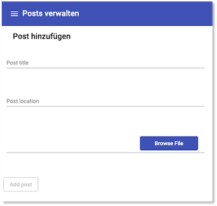

## Frontend

Um die Dateneingabe zu vereinfachen, erstellen wir uns ein einfaches Frontend mithilfe von [Angular]()https://angular.io/. Wie beim Backend auch, erstellen wir dieses Frontend Schritt für Schritt von Beginn an. 

Der im Folgenden beschriebene Code ist unter [GitHub](https://github.com/jfreiheit/ikt_frontend) verfügbar. Dieses Frontend ist zunächst bewusst einfach gehalten und enthält nur eine einzige Komponente `CreateComponent` zum Erstellen eines Datensatzes. Da wir [Angular Material](https://material.angular.io/) verwenden, sieht die `app.module.ts` wie folgt aus:

=== "app.module.ts"
    ```js
    import { BrowserModule } from '@angular/platform-browser';
    import { NgModule } from '@angular/core';

    import { AppRoutingModule } from './app-routing.module';
    import { AppComponent } from './app.component';
    import { BrowserAnimationsModule } from '@angular/platform-browser/animations';
    import { LayoutModule } from '@angular/cdk/layout';
    import { MatToolbarModule } from '@angular/material/toolbar';
    import { MatButtonModule } from '@angular/material/button';
    import { MatInputModule } from '@angular/material/input';
    import { MatSidenavModule } from '@angular/material/sidenav';
    import { MatIconModule } from '@angular/material/icon';
    import { MatListModule } from '@angular/material/list';
    import { MatCardModule } from '@angular/material/card';
    import { MatFormFieldModule } from '@angular/material/form-field';
    import { CreateComponent } from './create/create.component';
    import { HttpClientModule } from '@angular/common/http';
    import { FormsModule, ReactiveFormsModule } from '@angular/forms';
    import { ToastrModule } from 'ngx-toastr';

    @NgModule({
      declarations: [
        AppComponent,
        CreateComponent
      ],
      imports: [
        BrowserModule,
        AppRoutingModule,
        BrowserAnimationsModule,
        HttpClientModule,
        ReactiveFormsModule,
        FormsModule,
        LayoutModule,
        MatToolbarModule,
        MatButtonModule,
        MatInputModule,
        MatSidenavModule,
        MatIconModule,
        MatListModule,
        MatCardModule,
        MatFormFieldModule,
        ToastrModule.forRoot({
          timeOut: 2000,
          preventDuplicates: true,
        }),
      ],
      providers: [],
      bootstrap: [AppComponent]
    })
    export class AppModule { }
    ```  

Als einzige Route ist `/create` in der `app-routing.module.ts` definiert, wodurch die `CreateComponent` aufgerufen wird:

=== "app-routing.module.ts"
    ```js
    import { NgModule } from '@angular/core';
    import { Routes, RouterModule } from '@angular/router';
    import { CreateComponent } from './create/create.component';

    const routes: Routes = [
      { path: 'create', component: CreateComponent },
    ];

    @NgModule({
      imports: [RouterModule.forRoot(routes)],
      exports: [RouterModule]
    })
    export class AppRoutingModule { }
    ```  

### `AppComponent`

Die `AppComponent` enthält ausschließlich das mithilfe des [Navigation schematic](https://material.angular.io/guide/schematics#navigation-schematic) erstellte Navigationsgerüst. Als Inhalt in diesem Gerüst ist `<router-outlet></router-outlet>` enthalten, um die einzelnen Komponenten einzubinden:


=== "app.component.html"
    ```html
    <mat-sidenav-container class="sidenav-container">
        <mat-sidenav #drawer class="sidenav" fixedInViewport [attr.role]="(isHandset$ | async) ? 'dialog' : 'navigation'" [mode]="(isHandset$ | async) ? 'over' : 'side'" [opened]="(isHandset$ | async) === false">
            <mat-toolbar>Menu</mat-toolbar>
            <mat-nav-list>
                <a mat-list-item routerLink="/create" routerLinkActive="active">Neuen Datensatz</a>
            </mat-nav-list>
        </mat-sidenav>
        <mat-sidenav-content>
            <mat-toolbar color="primary">
                <button type="button" aria-label="Toggle sidenav" mat-icon-button (click)="drawer.toggle()" *ngIf="isHandset$ | async">
                    <mat-icon aria-label="Side nav toggle icon">menu</mat-icon>
                </button>
                <span>Posts verwalten</span>
            </mat-toolbar>
            <router-outlet></router-outlet>
        </mat-sidenav-content>
    </mat-sidenav-container>
    ```  

=== "app.component.ts"
    ```js
    import { Component } from '@angular/core';
    import { BreakpointObserver, Breakpoints } from '@angular/cdk/layout';
    import { Observable } from 'rxjs';
    import { map, shareReplay } from 'rxjs/operators';

    @Component({
      selector: 'app-root',
      templateUrl: './app.component.html',
      styleUrls: ['./app.component.css']
    })
    export class AppComponent {
      title = 'frontend';

      isHandset$: Observable<boolean> = this.breakpointObserver.observe(Breakpoints.Handset)
        .pipe(
          map(result => result.matches),
          shareReplay()
        );

      constructor(private breakpointObserver: BreakpointObserver) {}
    }
    ```  

Beide Dateien sind unverändert so übernommen, wie vom [Navigation schematic](https://material.angular.io/guide/schematics#navigation-schematic) erstellt. 

### `CreateComponent`

Selbst erstellt wurde nur die `CreateComponent`. In dieser Komponente wurde ein Formular nach [Material Design](https://material.angular.io/components/form-field/overview)-Vorgaben erstellt. Die `create.component.ts` sieht so aus:

=== "create/create.component.ts"
    ```js linenums="1"
    import { Component, OnInit, ViewChild, ElementRef } from '@angular/core';
    import { FormBuilder, FormControl, FormGroup, Validators } from '@angular/forms';
    import { ToastrService } from 'ngx-toastr';
    import { PostService, Post } from '../post.service';

    @Component({
      selector: 'app-create',
      templateUrl: './create.component.html',
      styleUrls: ['./create.component.css']
    })
    export class CreateComponent implements OnInit {

      @ViewChild('fileInput') fileInput: ElementRef;
      fileAttr = 'Choose File';
      formGroup: FormGroup;
      titleAlert = 'This field is required';
      imgBase64 = '';
      post: Post;

      constructor(
        private formBuilder: FormBuilder,
        private postService: PostService,
        private toastr: ToastrService) { }

      ngOnInit(): void {
        this.formGroup = this.formBuilder.group({
          inp_title: [null, Validators.required],
          inp_location: [null, Validators.required],
          uploadFile: [null, Validators.required]
        });
      }

      uploadFileEvt(imgFile: any): void {
        if (imgFile.target.files && imgFile.target.files[0]) {
          this.fileAttr = '';
          Array.from(imgFile.target.files).forEach((file: File) => {
            this.fileAttr += file.name + ' - ';
          });

          // HTML5 FileReader API
          const reader = new FileReader();
          reader.onload = (e: any) => {
            const image = new Image();
            image.src = e.target.result;
            image.onload = rs => {
              const imgBase64Path = e.target.result;
              this.imgBase64 = imgBase64Path.substr(imgBase64Path.indexOf(',') + 1);
              console.log('imgBase64Path', imgBase64Path);
              console.log('imgBase64', this.imgBase64);
            };
            this.formGroup.patchValue({ uploadFile: reader.result });
          };
          reader.readAsDataURL(imgFile.target.files[0]);
          // Reset if duplicate image uploaded again
          this.fileInput.nativeElement.value = '';
        } else {
          this.fileAttr = 'Choose File';
        }
      }

      get uploadFile(): FormControl {
        return this.formGroup.get('uploadFile') as FormControl;
      }

      get inp_title(): FormControl {
        return this.formGroup.get('inp_title') as FormControl;
      }

      get inp_location(): FormControl {
        return this.formGroup.get('inp_location') as FormControl;
      }

      async onSubmit(): Promise<void> {
        this.post = {
          id: 0,
          title: this.inp_title.value,
          location: this.inp_location.value,
          image: this.imgBase64
        };
        console.log('post', this.post);
        await this.postService.addPost(JSON.stringify(this.post));
        this.toastr.success('success');
        this.formGroup.reset();
      }
    }
    ```

=== "create/create.component.html"
    ```html linenums="1"
    <div class="container" novalidate>
    <mat-card class="example-card">
        <mat-card-header>
            <mat-card-title>Post hinzufügen</mat-card-title>
        </mat-card-header>
        <mat-card-content>
            <div [formGroup]="formGroup" class="my-form">

                <mat-form-field class="form-element">
                    <mat-label>Post title</mat-label>
                    <input matInput placeholder="Titel" formControlName="inp_title" />
                    <mat-error *ngIf="!inp_title.valid && inp_title.touched">
                        {{ titleAlert }}
                    </mat-error>
                </mat-form-field>

                <mat-form-field class="form-element">
                    <mat-label>Post location</mat-label>
                    <input matInput placeholder="Location" formControlName="inp_location" />
                    <mat-error *ngIf="!inp_location.valid && inp_location.touched">
                        {{ titleAlert }}
                    </mat-error>
                </mat-form-field>

                <mat-form-field>
                    <div>
                        <mat-toolbar>
                            <!-- Display files names -->
                            <input matInput [(ngModel)]="fileAttr" readonly name="name" />

                            <!-- Browse Button -->
                            <button mat-flat-button color="primary">
                        Browse File
                      </button>
                        </mat-toolbar>

                        <!-- Fetch selected filed on change -->
                        <input type="file" #fileInput id="uploadFile" (change)="uploadFileEvt($event)" name="uploadFile" multiple="multiple" accept="image/*" />
                    </div>
                </mat-form-field>

            </div>
        </mat-card-content>
        <mat-card-actions>
            <div class="form-element">
                <button mat-stroked-button (click)="onSubmit()" color="default" class="button" [disabled]="!formGroup.valid">
          Add post
        </button>
            </div>
        </mat-card-actions>
    </mat-card>
    <div *ngIf="imgBase64">
        {{ imgBase64 }}
    </div>
    </div>
    ```

In Zeile `15` wird eine Variable `formGroup` vom Typ `FormGroup` deklariert. Erzeugt wird das Formular mithilfe des `FormBuilder` (siehe Zeile `21`) in der `ngOnInit()`-Funktion (Zeilen `25-30`). Die drei `get`-Methoden (Zeilen `61-71`) dienen dem Zugriff auf die drei einzelnen Formularelemente.



Am unfrangreichsten ist hier die `uploadFileEvt`-Methode. Diese wird aufgerufen, wenn eine Bilddatei zum Upload ausgewählt wurde. Prinzipiell ist sogar die Auswahl mehrerer Dateien möglich. In Zeile `46` wird der Base64-Code des Bildes übergeben, dieser enthält aber noch den String `data:image/jpeg;base64,`. Dieser wird in Zeile `47` entfernt und der verbleibende Code in `imgBase64` gespeichert. 

Ist das gesamte Formular ausgefüllt, wird durch Klicken des `Add post`-Buttons (siehe `create.component.html`) die `onSubmit()`-Methode ausgelöst. In dieser Methode wird das `post`-Objekt erzeugt, welches an die `addPost`-Methode des `postService` übergeben wird.  

### `post.service.ts`

Der `PostService` stellt die Verbindung zum Backend dar. Dazu verwendet der `PostService` das `HttpClient`- und das `HttpHeaders`-Modul: 

=== "post.service.ts"
    ```js linenums="1"
    import { HttpClient, HttpHeaders } from '@angular/common/http';
    import { Injectable } from '@angular/core';


    export interface Post {
      id: number;
      title: string;
      location: string;
      image: string;
    }

    @Injectable({
      providedIn: 'root'
    })
    export class PostService {
      apiUrl = 'http://localhost:3000/posts';

      constructor(private http: HttpClient) { }


      public async addPost(post): Promise<Post> {
        return this.http
          .post<Post>(`${this.apiUrl}`, post, {
            headers: new HttpHeaders({
              'Content-Type': 'application/json',
            }),
          })
          .toPromise();
      }
    }
    ```

Derzeit ist im `PostService` noch nur eine Funktion implementiert, die `addPost()`. Diese ruft im Backend den Endpunkt `POST http://localhost:3000/posts` auf und übergibt das `post`-Objekt, das im *Request-Body* versendet wird.   


!!! success
    Wir haben uns zwar in Sachen *Progressive Web Apps* nicht wirklich weiterentwickelt, aber wir haben nun erstmal einige nützliche Hilfsmittel geschaffen, um eine "größere" Anwendung später *progressive* zu gestalten. Es gibt nun eine Datenbank, die Bilder speichern kann und das passende Backend zur Anbindung der Datenbank. Zur Erleichterung der Dateneingabe in die Datenbank haben wir uns auch ein Frontend erstellt.   

