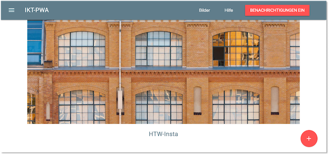
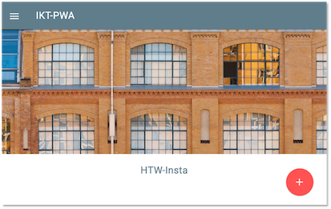
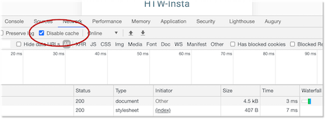

# Grundgerüst unserer PWA

Wir beginnen jetzt mit der Implementierung von *progressive* Funktionalitäten. Das machen wir, indem wir sukzessive eine Progressive Web app erstellen, die viele der derzeit verfügbaren Funktionalitäten enthält, die derzeit für *Progressive Web Apps* verfügbar sind. Das Grundgerüst (oder der Ausgangspunkt) unserer PWA wird deshalb zur Verfügung gestellt, weil wir uns nicht um die Implementierung von HTML, CSS und JavaScript, sondern nur um die *progressive* Funktionalitäten kümmern wollen. Auf Basis dieses Grundgerüstes werden sukzessive Funktionalitäten, wie Push-Notifikationen, Offline-Verwendung, Geolocation, Kameranutzung usw. hinzufügen. Die Idee ist, dass wir eine Art HTW-Instagram erstellen. ich habe Instagram aber noch nie genutzt, deshalb weiß ich nicht, ob wir dem "Original" nahe kommen werden. Wahrscheinlich nicht, aber dafür behalten wir unsere Daten auch bei uns. 

## Installation

Den Quellcode für das Grundgerüst finden Sie [hier (GitHub)](https://github.com/jfreiheit/IKT-PWA-01). Clonen Sie sich das Projekt in einem Ordner Ihrer Wahl und folgen Sie dann der `README.MD`: 

- Zum Ausführen des Projektes wird [Node.js](https://nodejs.org) verendet. Sie müssen es auf Ihren Rechner installieren. 

- In der Wahl Ihrer IDE sind Sie völlig frei. Empfehlungen finden Sie unter [https://freiheit.f4.htw-berlin.de/ikt/tools/#integrated-development-environment-ide](https://freiheit.f4.htw-berlin.de/ikt/tools/#integrated-development-environment-ide)

- Zum Starten des Projektes wechseln Sie im Terminal (Terminal Ihres Rechners oder das Terminal in der IDE) in den Projektordner (`cd IKT-PWA-01`) und führen dort 

	`npm install` 

	aus. Damit werden alle erforderlichen Abhängigkeiten installiert.

- Nach erfolgreicher Installation der Abhängigkeiten, geben Sie  

	`npm start` 

	ein, um Ihr Projekt auszuführen. Klicken Sie danach auf [localhost:8080](http://localhost:8080) oder geben Sie die URL direkt in Ihren Browser ein.

- Sollten Sie Änderungen an der Implementierung vornehmen und diese ausprobieren wollen, müssen Sie den Server zunächst wieder stoppen:

	`Ctrl-C`

	und geben dann erneut 

	`npm start` 

	ein. 

## Starten

Starten Sie das Projekt mit `npm start` (nachdem Sie einmalig `npm install` ausgefürht haben) und öffnen Sie dann den Browser mit der URL `http://localhost:8080/`. Es erscheint



bzw. wenn Sie die Viewport-Breite verkleinern

. 

Sie erkennen wahrscheinlich schon, dass wir [Material Design Lite](https://getmdl.io/) verwenden. Die Navigationskomponente kennen wir auch schon aus WebTech. Wenn Sie auf den `+`-Button klicken, erscheint ein kleines Menü. Dort können Sie zwar schon etwas eintragen, aber der `SPEICHERN`-Button funktioniert noch nicht. Auch beim `BENACHRICHTIGUNGEN EIN`-Button ist noch keine Ereignisbehandlung hinterlegt. Wenn Sie im Menü `Hilfe`klicken, öffnet sich die (fast leere) Hilfe-Seite. 

Schalten Sie beim Betrachten der Anwendung stets die `DeveloperTools` ein. Sie können dort sehr leicht auf die mobile Ansicht wechseln. Wichtig ist, dass Sie - zum besseren Ausprobieren der Anwendung - in den DeveloperTools unter dem Reiter `Network` ein Häkchen bei `Disable Cache` setzen. Wir wollen in Zukunft das Caching unseren *Service workern* überlassen und nicht den Cache des Browsers verwenden. 



## Projekt

Bevor wir loslegen, werfen wir noch einen kurzen Blick auf die bisherigen Dateien im Projekt. Wir beginnen mit der `index.html` aus dem `public`-Ordner.

=== "public/index.html"
	```html linenums="1"
	<!doctype html>
	<html lang="en">
	<head>
	  <meta charset="UTF-8">
	  <meta name="viewport"
	        content="width=device-width, user-scalable=no, initial-scale=1.0, maximum-scale=1.0, minimum-scale=1.0">
	  <meta http-equiv="X-UA-Compatible" content="ie=edge">
	  <title>IKT-PWA</title>
	  <link href="https://fonts.googleapis.com/css?family=Roboto:400,700" rel="stylesheet">
	  <link rel="stylesheet" href="https://fonts.googleapis.com/icon?family=Material+Icons">
	  <link rel="stylesheet"
	        href="https://code.getmdl.io/1.3.0/material.blue_grey-red.min.css">
	  <link rel="stylesheet" href="/src/css/app.css">
	  <link rel="stylesheet" href="/src/css/feed.css">
	</head>
	<body>

	<div id="app">
	  <div class="mdl-layout mdl-js-layout mdl-layout--fixed-header">
	    <header class="mdl-layout__header">
	      <div class="mdl-layout__header-row">
	        <!-- Title -->
	        <span class="mdl-layout-title">IKT-PWA</span>
	        <!-- Add spacer, to align navigation to the right -->
	        <div class="mdl-layout-spacer"></div>
	        <!-- Navigation. We hide it in small screens. -->
	        <nav class="mdl-navigation mdl-layout--large-screen-only">
	          <a class="mdl-navigation__link" href="/">Bilder</a>
	          <a class="mdl-navigation__link" href="/help">Hilfe</a>
	          <div class="drawer-option">
	            <button class="enable-notifications mdl-button mdl-js-button mdl-button--raised mdl-button--colored mdl-color--accent">
	              Benachrichtigungen Ein
	            </button>
	          </div>
	        </nav>
	      </div>
	    </header>
	    <div class="mdl-layout__drawer">
	      <span class="mdl-layout-title">IKT-PWA</span>
	      <nav class="mdl-navigation">
	        <a class="mdl-navigation__link" href="/">Bilder</a>
	        <a class="mdl-navigation__link" href="/help">Hilfe</a>
	        <div class="drawer-option">
	          <button class="enable-notifications mdl-button mdl-js-button mdl-button--raised mdl-button--colored mdl-color--accent">
	            Benachrichtigungen Ein
	          </button>
	        </div>
	      </nav>
	    </div>
	    <main class="mdl-layout__content mat-typography">
	      <div id="create-post">
	        <form>
	          <div class="input-section mdl-textfield mdl-js-textfield mdl-textfield--floating-label">
	            <input class="mdl-textfield__input" type="text" id="title">
	            <label class="mdl-textfield__label" for="title" name="title">Titel</label>
	          </div>
	          <div class="input-section mdl-textfield mdl-js-textfield mdl-textfield--floating-label" id="manual-location">
	            <input class="mdl-textfield__input" type="text" id="location">
	            <label class="mdl-textfield__label" for="location" name="location">Ort</label>
	          </div>
	          <br>
	          <div>
	            <button class="mdl-button mdl-js-button mdl-button--raised mdl-button--colored mdl-color--accent"
	                    type="submit" id="post-btn">Speichern
	            </button>
	          </div>
	          <br>
	          <div>
	            <button class="mdl-button mdl-js-button mdl-button--fab" id="close-create-post-modal-btn" type="button">
	              <i class="material-icons">close</i>
	            </button>
	          </div>
	        </form>
	      </div>
	      
	      <div class="page-content">
	        <h5 class="text-center mdl-color-text--primary">HTW-Insta</h5>
	        <div id="shared-moments"></div>
	      </div>
	      <div class="floating-button">
	        <button class="mdl-button mdl-js-button mdl-button--fab mdl-button--colored"
	                id="share-image-button">
	          <i class="material-icons">add</i>
	        </button>
	      </div>
	      <div id="confirmation-toast" aria-live="assertive" aria-atomic="true" aria-relevant="text" class="mdl-snackbar mdl-js-snackbar">
	        <div class="mdl-snackbar__text"></div>
	        <button type="button" class="mdl-snackbar__action"></button>
	      </div>
	    </main>
	  </div>
	</div>
	<script defer src="/src/js/material.min.js"></script>
	<script src="/src/js/app.js"></script>
	<script src="/src/js/feed.js"></script>
	</body>
	</html>
	```

Sie sieht recht umfangreich aus. tatsächlich ist aber das meiste darin für das Navigationstemplate. Die Zeilen `21-36` und `38-49` beschreiben das gleiche, nämlich die Navigationsleiste. Der obere Block ist für breite Viewports (Klasse `mdl-layout--large-screen-only`). Alle `mdl`-Klassen sind von Material. Einen guten Überblick über die einzelnen Material-Komponenten finden Sie [hier](https://getmdl.io/components/index.html). Näheres zu den Navigationen finden Sie darin z.B. [hier](https://getmdl.io/components/index.html#layout-section/layout). Dann kommt das Bild (Zeilen `75-77`), dann der Text `HTW Insta` (Zeilen `78-81`) und dann der `+`-Button (Zeilen `82-87`). In den Zeilen `88-91` ist bereits eine Bestätigungsnachricht hinterlegt, derzeit aber noch `hidden`. 

In den eingeundenen eigenen Stylesheets `app.css` und `feed.css` steht nicht viel: 

=== "public/src/css/app.css"
	```css linenums="1"
	.text-center {
	  text-align: center;
	}

	.drawer-option {
	  padding: 16px;
	}
	```

=== "public/src/css/feed.css"
	```css linenums="1"
	#create-post {
	  z-index: 1001;
	  position: fixed;
	  width: 100%;
	  min-height: 100vh;
	  overflow-y: scroll;
	  bottom: 0;
	  top: 56px;
	  background: white;
	  text-align: center;
	  display: none;
	}

	.main-image {
	  max-width: 100%;
	  margin: auto;
	  display: block;
	}

	.floating-button {
	  z-index: 1000;
	  position: fixed;
	  bottom: 0;
	  right: 0;
	  padding: 30px;
	}

	.input-section {
	  display: block;
	  margin: 10px auto;
	}
	```

Kurze Erinnerung an CSS: Punktselektoren beschreiben Klassen (z.B. `.input-selection`) und #-Selektoren beschreiben Ids (z.B. `#create-post`). Sie können die Anwendung der Klassen und der Ids ja mal in der `index.html` suchen, wenn Sie möchten. 

Die `public/help/index.html` enthält noch weniger als die `public/index.html`. Erwähnenswert ist hier, dass wir mit einem Framework wie z.B. Angular natürlich der Navigation eine eigenen Komponente spendiert und diese nicht in beiden Dateien wiederholt hätten.

=== "public/help/index.html"
	```html linenums="1"
	<!doctype html>
	<html lang="en">
	<head>
	  <meta charset="UTF-8">
	  <meta name="viewport"
	        content="width=device-width, user-scalable=no, initial-scale=1.0, maximum-scale=1.0, minimum-scale=1.0">
	  <meta http-equiv="X-UA-Compatible" content="ie=edge">
	  <title>Help</title>
	  <link href="https://fonts.googleapis.com/css?family=Roboto:400,700" rel="stylesheet">
	  <link rel="stylesheet" href="https://fonts.googleapis.com/icon?family=Material+Icons">
	  <link rel="stylesheet"
	        href="https://code.getmdl.io/1.3.0/material.blue_grey-red.min.css">
	  <link rel="stylesheet" href="/src/css/help.css">
	</head>
	<body>

	<div id="app">
	  <div class="mdl-layout mdl-js-layout mdl-layout--fixed-header">
	    <header class="mdl-layout__header">
	      <div class="mdl-layout__header-row">
	        <!-- Title -->
	        <span class="mdl-layout-title">IKT-PWA</span>
	        <!-- Add spacer, to align navigation to the right -->
	        <div class="mdl-layout-spacer"></div>
	        <!-- Navigation. We hide it in small screens. -->
	        <nav class="mdl-navigation mdl-layout--large-screen-only">
	          <a class="mdl-navigation__link" href="/">Bilder</a>
	          <a class="mdl-navigation__link" href="/settings">Einstellungen</a>
	          <div class="drawer-option">
	            <button class="enable-notifications mdl-button mdl-js-button mdl-button--raised mdl-button--colored mdl-color--accent">
	              Benachrichtigungen Ein
	            </button>
	          </div>
	        </nav>
	      </div>
	    </header>
	    <div class="mdl-layout__drawer">
	      <span class="mdl-layout-title">IKT-PWA</span>
	      <nav class="mdl-navigation">
	        <a class="mdl-navigation__link" href="/">Feed</a>
	        <a class="mdl-navigation__link" href="/help">Help</a>
	        <div class="drawer-option">
	          <button class="enable-notifications mdl-button mdl-js-button mdl-button--raised mdl-button--colored mdl-color--accent">
	            Benachrichtigungen Ein
	          </button>
	        </div>
	      </nav>
	    </div>
	    <main class="mdl-layout__content mat-typography">
	      <div class="mdl-grid">
	        <div class="mdl-cell mdl-cell--12-col text-center">
	         <h3>Brauchst Du Hilfe?</h3>
	          <p>Hier erfährst Du, wie Du die App benutzen und neue Bildeinträge erstellen kannst.</p>
	        </div>
	      </div>
	      <div class="mdl-grid">
	        <div class="mdl-cell mdl-cell--12-col text-center">
	          <h3>Kontakt</h3>
	          <div>
	            <button class="mdl-button mdl-js-button mdl-button--fab mdl-button--colored">
	              <i class="material-icons">call</i>
	            </button>
	            <button class="mdl-button mdl-js-button mdl-button--fab mdl-button--colored">
	              <i class="material-icons">email</i>
	            </button>
	            <button class="mdl-button mdl-js-button mdl-button--fab mdl-button--colored">
	              <i class="material-icons">chat_bubble</i>
	            </button>
	          </div>
	        </div>
	      </div>
	    </main>
	  </div>
	</div>

	<script defer src="/src/js/material.min.js"></script>
	<script src="/src/js/app.js"></script>
	</body>
	</html>
	```

Von den beiden JavaScript-Dateien `public/src/js/app.js` und `public/src/js/feed.js` steht derzeit nur etwas in der `feed.js`. Das schauen wir uns aber erst dann an, wenn wir neue Bildeinträge speichern wollen. 
