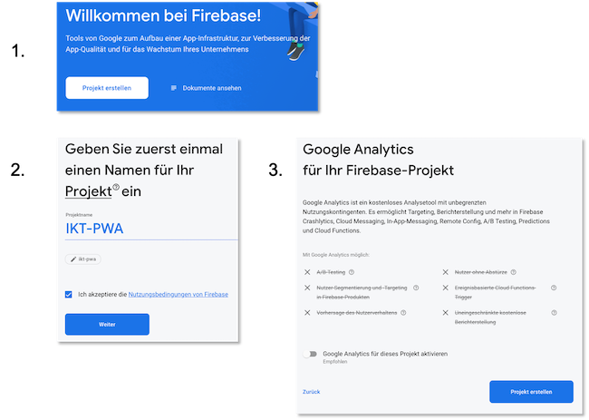
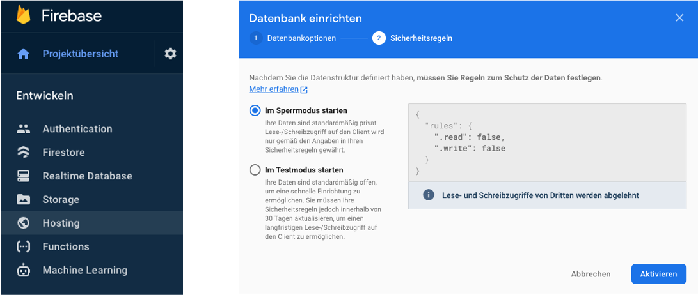
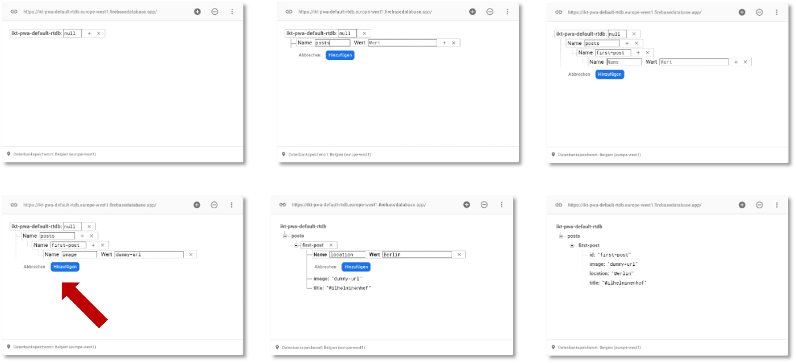

# IndexedDB 

Wir haben jetzt verschiedene Ressourcen in statischen und dynamischen Caches gespeichert. Diese Ressourcen lagen als Dateien vor, die wir über eine URL abrufen konnten, also `*.html`-, `*.js`-, `*.css`- Dateien und Bilder. Jetzt wollen wir dynamisch *Daten* speichern, sogenannten *dynamischen Inhalt*. Diese Daten können ausgelesen und den unterschiedlichen Dateien hinzugefügt bzw. durch Dateien hinzugefügt werden. Wir können uns das wirklich wie eine Datenbank vorstellen, aus der wir diese Daten ziehen, nur dass diese Datenbank nicht extern in einem Datenbankmanagementsystem verwaltet wird, sondern durch den Browser. Wir haben unter den Developer Tools diese "Datenbank" vielleicht schon im `Application`-Reiter auf der linken Seite unter `Storage` entdeckt. Es handelt sich um die `IndexedDB`. 

Bevor wir `IndexedDB` verwenden, bauen wir uns noch ein kleines Backend mithilfe von [Firebase](https://firebase.google.com/?hl=de). Wir können auf den Sourcecode von [IKT-PWA-04](./files/IKT-PWA-04.zip) aufbauen. Sie können aber auch Ihre eigenes Projekt verwenden. 

Wir benötigen dafür leider einen Google-Account, aber Sie können sich recht leicht eine fake-Email-Adresse bei `gmail.com` besorgen. Ansonsten kann man auch Einweg-E-Mail-Provider, wie z.B. [https://temp-mail.org/de/](https://temp-mail.org/de/) verwenden. Nachdem Sie sich eingeloggt haben, können Sie ein `Projekt erstellen`. 



In Firebase wählen wir links im Menü `Entwicklen` und darin `Realtime Database`. Dann klicken wir auf `Datenbank erstellen`, wählen irgendeinen erupäischen Standort und starten unsere Datenbank zunächst im Sperrmodus - das ändern wir gleich. 



Dazu klicken wir auf `Regeln`, um diese zu bearbeiten. Das JSON sieht zunächst so aus: 

```json
{
  "rules": {
    ".read": false,
    ".write": false
  }
}
```  

Wir wollen zunächst das Lesen grundsätzlich erlauben und ändern deshalb dafür den Eintrag auf `true`.


```json linenums="1" hl_lines="3"
{
  "rules": {
    ".read": true,
    ".write": false
  }
}
```  

Man kann hier auch Authentifizierungsmethoden angeben, damit beschäftigen wir uns hier aber nicht. Klicken Sie nach der Änderung auf `Veröffentlichen` (`Publish`). 

Jetzt klicken wir im Reiter auf `Daten`, um unserer Datenbank einige Daten hinzuzufügen. Die Einträge erfolgen ebenfalls im JSON-Format. Die folgende Abbildung zeigt ein paar Bearbeitungsschritte (für neue Einträge auf das `+`  neben `null` klicken).



Es ensteht das folgende JSON:


```json
{
  "posts": {
    "first-post": {
    	"id": "first-post",
    	"image": "dummy-url",
    	"location": "Berlin",
    	"title": "Wilhelminenhof"
    }
  }
}
```  

Danach klicken wir links im Menü auf `Storage`, um ein Bild hochzuladen. Im `Storage` klicken wir auf `Jetzt starten` und die Einrichtung können wir einfach mit `Weiter` bestätigen. Wählen Sie irgendeinen europäischen Standort. Wir werden Google keine sensiblen Daten hochladen. Wir laden das Bild hoch, das wir auch bereits in der Anwendung als ein Blogpost verwendet hatten ([hier nochmal zum Download](./files/htw-gebaeude-h.jpg)).