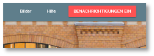
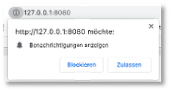
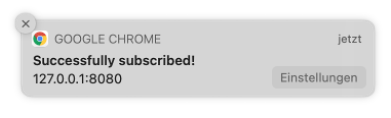
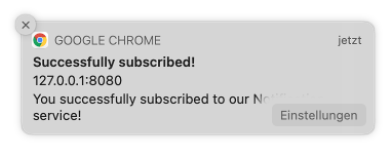

# Push Notifications

*Push Notifications* sind sinnvoll, um die Nutzerin einer App über Neuigkeiten zu informieren, sogar dann, wenn die Anwendung (und der Browser!) geschlossen ist (sind). Mit *Push Notifications* können Nutzerinnen wieder "zurück an die App geholt" werden, d.h. mithilfe von *Push Notifications* kann man dafür sorgen, dass Nutzerinnen die App wieder öffnen, um sich die Neuigkeiten genauer anzuschauen. Die Neuigkeiten können neue Tweets, E-Mails, Nachrichten, Anrufe usw. sein. 

Das Prinzip, das für die Push-Benachrichtungen umgesetzt wird, sieht auf den ersten Blick etwas kompliziert aus:


Im Zentrum stehen zunächst die Webanwendung und der Service Worker. Die Webanwendung meldet sich bei den Push-Benachrichtigungen an und der Service Worker verwaltet diese. Jeder Browser hat eine eigenen "eingebauten" *Push Server*. Eine *Push-Anmeldung* (*Push Subscription*) erlaubt den Zugriff auf einen *Push-API-Endpunkt* auf den Push-Server. Die eigentliche *Push-Benachrichtigung* kommt jedoch vom eigenen Server. Er sendet die Push-Nachricht an den *In-Browser Push Server*, dieser löst damit ein `push`-Ereignis beim Service Worker aus und der Service Worker schickt die *Push-Benachrichtigung* an die Webanwendung. 

Wir schauen uns alle diese Schritte im Detail an. Ausgangspunkt ist das [Projekt in diesem Stand](./files/IKT-PWA-06.zip).

## Anzeigen von Benachrichtigungen

Wir beginnen mit dem Anzeigen (der Darstellung) von Push-Benachrichtigungen in einer Webanwendung. Dieser Abschnitt hat **noch nichts** mit dem `push`-Ereignis zu tun! Wir benötigen zum Anzeigen nicht mal einen Service Worker. Es geht aber auch über den Service Worker - und das wird später auch bei der Verwendung der *Push-API* notwendig. Die hier verwendete [Notification-API](https://developer.mozilla.org/en-US/docs/Web/API/notification) wird von fast allen Browsern unterstützt. [Hier](https://developer.mozilla.org/en-US/docs/Web/API/Notifications_API/Using_the_Notifications_API) ist auch eine gute Übersicht darüber, wie diese *Notification-API* verwendet wird. 

### Benachrichtigungen einschalten

Bevor wir das Anzeigen von *(Push-)Benachrichtigungen* betrachten, müssen wir diese zuerst erlauben. In unserer Anwendung gibt es dazu den Button `BENACHRICHTIGUNGEN EIN`. 



In der `index.html` ist dieser Button zwei Mal definiert, einmal für einen schmalen Viewport und einmal für einen breiten. Für beide Varianten sieht die Implementierung so aus: 

```html
<div class="drawer-option">
      	<button class="enable-notifications mdl-button mdl-js-button mdl-button--raised mdl-button--colored mdl-color--accent">
  			Benachrichtigungen Ein
		</button>
</div>
```

Für einen schmalen Viewport ist der Button dann unter dem Hamburger Menü in der linken oberen Ecke erreichbar. Beiden Buttons ist die CSS-Klasse `enable-notifications` zugewiesen. Wir sorgen zuerst dafür, dass dieser Button nur angezeigt wird, wenn der Browser die *Notification-API* unterstützt. Wenn nicht, dann wäre der Button funktionslos und wir bräuchten ihn nicht. Wir schalten ihn deshalb in der `app.css` zunächst im Standartwert aus:

=== "/src/css/app.css"
	```css linenums="1" hl_lines="9-11"
	.text-center {
	  text-align: center;
	}

	.drawer-option {
	  padding: 16px;
	}

	.enable-notifications {
	  display: none;
	}
	```

In der `app.js` prüfen wir, ob der Browser die *Notification-API* unterstützt und schalten für diesen Fall die Buttons wieder ein. 


=== "/src/js/app.js"
	```js linenums="1" hl_lines="1 14-23 25-30"
	let enableNotificationsButtons = document.querySelectorAll('.enable-notifications');

	if ('serviceWorker' in navigator) {
	    navigator.serviceWorker
	        .register('/sw.js')
	        .then(() => {
	            console.log('service worker registriert')
	        })
	        .catch(
	            err => { console.log(err); }
	        );
	}

	function askForNotificationPermission() {
	    Notification.requestPermission( result => {
	        console.log('User choice', result);
	        if(result !== 'granted') {
	            console.log('No notification permission granted');
	        } else {
	            // notifications granted
	        }
	    });
	}

	if('Notification' in window) {
	    for(let button of enableNotificationsButtons) {
	        button.style.display = 'inline-block';
	        button.addEventListener('click', askForNotificationPermission);
	    }
	}
	```

- In Zeile `1` erstellen wir uns eine Variable `enableNotificationsButtons`, die auf ein Array aller Buttons mit der CSS-Klasse `enable-notifications` zeigt. 
- In Zeile `25` prüfen wir nun, ob der Browser die `Notification`-API unterstützt. Wenn ja, dann schalten wir alle Buttons aus dem `enableNotificationsButtons`-Array wieder auf sichtbar (von `display: none` auf `display: inline-block`) und wir melden jeden dieser Buttons an die Ereignisbehandlung des `click`-Ereignisses an (Zeile `28`). 
- Die Behandlung des `click`-Ereignisses erfolgt in der Methode `askForNotificationPermission()`, die in den Zeilen `14-23` definiert ist. Da diese Methode nur dann aufgerufen wird, wenn der Browser die `Notification`-API unterstützt, kann diese API darin verwendet werden. 
- Mit der Funktion [requestPermission()](https://developer.mozilla.org/en-US/docs/Web/API/Notification/requestPermission) wird die Nutzerin gefragt, ob sie Benachrichtigungen zulassen möchte. Diese Methode gibt ein Promise zurück, dessen `result` die Werte `granted`, `denied` oder `default` haben kann. Werden Benachrichtigungen nicht erlaubt (Zeile `17`), können wir nichts weiter tun. Die Nutzerin wird dann auch nicht erneut gefragt. Die Benachrichtigungen bleiben für die Webanwendung ausgeschaltet (Zeile `18`). 

Wenn wir die Anwendung nun ausführen (Reload nach `Application --> Storage --> Clear Storage` oder die Versionsnummern der Caches im Service Worker ändern), dann erhalten wir nach dem Klicken auf den `BENACHRICHTIGUNGEN EIN`-Button folgende Abfrage:



Wenn wir auf `Zulassen` klicken, dann erscheint in der Konsole `User Chaice granted` (Zeile `16`). Beachten Sie, dass Sie nicht erneut gefragt werden, ob Benachrichtungen zugelassen werden sollen oder nicht. Erneutes Klicken auf den Button bewirkt (selbst nach einem Reload der Anwendung) keine erneute Abfrage. Deshalb wäre es eigentlich auch sinnvoll, den Button wieder zu verstecken, d.h. auf `display: none` zu setzen. 


### Benachrichtigungen anzeigen

Jetzt erstellen wir unsere erste Benachrichtigung mithilfe der `Notification`-API. Die einfachtse Form der `Notification` wird durch die Verwendung des parametrisierten Konstruktors von `Notification` (`new Notification('Nachricht')`) erstellt. Wir fügen die `app.js` eine solche einfache Benachrichtigung für den Fall, dass Benachrichtigungen erlaubt werden, ein:


=== "/src/js/app.js"
	```js linenums="1" hl_lines="14-16 24"
	let enableNotificationsButtons = document.querySelectorAll('.enable-notifications');

	if ('serviceWorker' in navigator) {
	    navigator.serviceWorker
	        .register('/sw.js')
	        .then(() => {
	            console.log('service worker registriert')
	        })
	        .catch(
	            err => { console.log(err); }
	        );
	}

	function displayConfirmNotification() {
	    new Notification('Successfully subscribed!');
	}

	function askForNotificationPermission() {
	    Notification.requestPermission( result => {
	        console.log('User choice', result);
	        if(result !== 'granted') {
	            console.log('No notification permission granted');
	        } else {
	            displayConfirmNotification();
	        }
	    });
	}

	if('Notification' in window) {
	    for(let button of enableNotificationsButtons) {
	        button.style.display = 'inline-block';
	        button.addEventListener('click', askForNotificationPermission);
	    }
	}
	```


Wenn wir die Anwendung nun erneut ausführen und auf den Button klicken, dann werden wir zwar nicht erneut gefragt, ob wir Benachrichtigungen zulassen oder blockieren wollen, aber da wir Benachrichtungen bereits zugelassen haben, erscheint nun die folgende Benachrichtigung:




Der einfache Aufruf des `Notification`-Konstruktors mit einer einfachen Nachricht (Zeile `15`) erzeugt auch die einfachste Form der Benachrichtigung. Dem Konstruktor lassen sich aber als zweiten Parameter noch JavaScript-Objekt für `options` übergeben. Darin kann ein weiterer Text (`body`) definiert werden und z.B. auch ein eigenes `icon`. Wir betrachten das später noch etwas genauer, erstmal nur eine weitere Nachricht: 


=== "/src/js/app.js"
	```js linenums="14" hl_lines="2-3"
	function displayConfirmNotification() {
	    let options = { body: 'You successfully subscribed to our Notification service!'};
	    new Notification('Successfully subscribed!', options);
	}
	```

ergibt dann die Benachrichtigung:





### Benachrichtigungen im Service Worker erstellen

Im jetzigen Stand werden die Benachrichtungen aus der Webanwendung heraus erstellt. Das ist auch völlig ok. Die `Notification`-API lässt sich sowohl in der Webanwendung verwenden, als auch im Service Worker. Da später aber die *Push-Benachrichtigungen* vom Service Worker verwaltet werden, wechseln wir jetzt auch für die einfachen Benachrichtigungen zum Service Worker, d.h. wir lassen die Benachrichtigungen nun nicht mehr durch die Webanwendung erstellen, sondern durch den Service Worker. Dazu passen wir unsere `app.js` wie folgt an:


=== "/src/js/app.js"
	```js linenums="14" hl_lines="2-3"
	function displayConfirmNotification() {
	    if('serviceWorker' in navigator) {
	        let options = { body: 'You successfully subscribed to our Notification service!'};

	        navigator.serviceWorker.ready
	            .then( sw => {
	                sw.showNotification('Successfully subscribed (from SW)!', options);
	            });
	    }
	}
	```

Der Service Worker besitzt eine eigene Funktion `showNotification()`, die intern ein `Notification`-Objekt erzeugt und der die gleiche Parameterliste übergeben werden kann, wie dem `Notification`-Konstruktor. 


