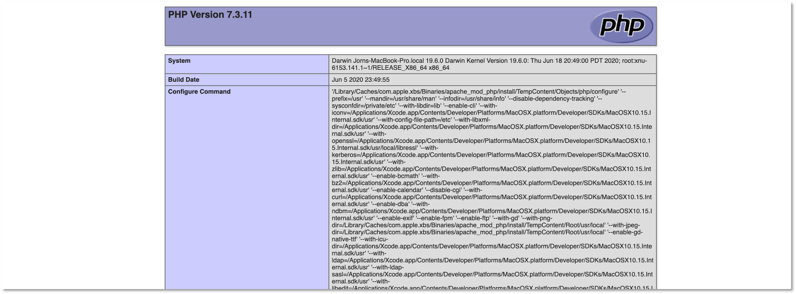

# Übungen


##### Übung 1 (Grundgerüst)

??? "Übung 1"

	1. In der ersten Übung geht es "nur" darum, das [Grundgerüst](../grundgeruest/#grundgerust-unserer-pwa) zu verstehen. Arbeiten Sie dazu diesen Abschnitt durch. Sie werden feststellen, dass sich die meisten Anweisungen (insb. im `HTML`-Code) auf [Material Design Lite](https://getmdl.io/) beziehen. 
	2. Um zu erkennen, was einen [Material Design Lite](https://getmdl.io/)-Bezug hat (und somit nicht wirklich wichtig ist),  ändern Sie das Grundgerüst so, dass Sie nicht [Material Design Lite](https://getmdl.io/), sondern [Bootstrap](https://getbootstrap.com/docs/4.6/getting-started/introduction/) verwenden. Werfen Sie also Material Design Lite komplett raus und ersetzen es vollständig durch Bootstrap. Löschen Sie die `material.min.js` aus dem `public/js`-Ordner.
	3. Starten Sie am besten damit, diese drei Zeilen aus den beiden `index.html`-Dateien zu löschen:
		```html
		<link href="https://fonts.googleapis.com/css?family=Roboto:400,700" rel="stylesheet">
		<link rel="stylesheet" href="https://fonts.googleapis.com/icon?family=Material+Icons">
		<link rel="stylesheet" href="https://code.getmdl.io/1.3.0/material.blue_grey-red.min.css">
		```
	4. Fügen Sie stattdessen den CSS-Link und das JS-Bundle aus [https://getbootstrap.com/docs/4.6/getting-started/introduction/](https://getbootstrap.com/docs/4.6/getting-started/introduction/) ein. 
	5. Sie können ja versuchen, dass es möglichst ähnlich aussieht:
		


##### Übung 2 (Web App Manifest)

??? "Übung 2"

	1. Erweitern Sie Ihre Anwendung (oder das Grundgerüst) um ein Web App Manifest. Verwenden Sie zur Erstellung des Manifestes am besten den [Web-App-Manifest-Generator](https://www.dunplab.it/web-app-manifest-generator). 
	2. Wählen Sie ein eigenes Icon. Beachten Sie, dass das Original-Icon die Maße 512x512 Pixel aufweisen muss. Der [Web-App-Manifest-Generator](https://www.dunplab.it/web-app-manifest-generator) fügt das Original-Icon nicht dem Manifest hinzu. [Lighthouse](../tools/#lighthouse) beschwert sich darüber, dass dem Manifest ein 512x512-Icon fehlt. Fügen Sie dieses am besten noch händisch hinzu. 
	3. Die Anwendung soll in dem Moment installiert werden, wenn die Nutzerin das erste Mal auf den `+`-Button klickt. Das heißt, es wird das `beforeinstallprompt`-Ereignis ausgelöst und die Behandlung dieses Ereignisses sorgt dafür, dass Sie die Anwendung genau dann installieren, wenn Sie das erste Mal den `+`-Button klicken: 
	4. Hinweise und Hilfestellungen finden Sie z.B. [hier](https://web.dev/codelab-make-installable/) oder im [Skript](../manifest/#das-beforeinstallprompt-ereignis) (enthält weitere Links) oder im [Video zum Manifest](http://../#woche-2-manifest).


##### Übung 3 (Promises und Fetch API)

??? "Übung 3"

	1. Laden Sie [hier die Anwendung für Übung 3 herunter](./files/uebung3.zip). Es handelt sich um eine zip-Datei. Entpacken Sie diese, öffnen Sie sie in Ihrer IDE und folgen Sie der README.MD. 
	2. In der Übung üben wir Promises und die Fetch API. Öffnen Sie die Datei `public/src/js/app.js`. Die Übung besteht aus 3 Teilen:
	3. **Teil 1**: führen Sie ein `fetch()` als GET nach `https://httpbin.org/ip` aus und geben Sie die zurückgegebene IP in das `output`-Element (`<p id="output"></p>`) in der `public/index.html` aus.
	4. **Teil 2**: führen Sie ein `fetch()` als PUT nach `https://httpbin.org/put` aus. Das übergebene JSON wird von dort einfach zurückgespiegelt. Geben Sie einen oder mehrere Werte aus diesem JSON in das `output`-Element (`<p id="output"></p>`) in der `public/index.html` aus.
	5. **Teil 3**: bauen Sie einen Fehler in die Anfrage (z.B. falsche Url) und behandeln Sie diesen Fehler mit einer Ausgabe auf die Konsole.
	6. Hinweise und Hilfestellungen finden Sie im Skript unter [Promises und die Fetch-API](../promises/#promises-und-die-fetch-api).


##### Übung 4 (Entwicklungs-Infrastruktur einrichten)

??? "Übung 4"

	Wir richten unsere Entwicklungs-Infrastruktur, die wir benötigen, um eine Frontend-Backend-Datenbank-App zu erstellen.

	1. Lokalen Webserver einrichten: 

		- Es sollte etwas Sinnvolles erscheinen, wenn Sie `http://localhost/` in den Browser eingeben (also entweder wird eine eigene html- oder php-Datei geöffnet, oder es steht soetwas wie `It works`). Wenn das nicht der Fall ist, dann benötigen Sie erst noch einen Webserver. Auf dem Mac und unter Linux existiert aber immer bereits einer, nur unter Windows muss dann z.B. [XAMPP](https://www.apachefriends.org/de/index.html) installiert werden.

		- Sie müssen wissen, aus welchem Ordner die Ressourcen geladen werden, wenn Sie `http://localhost/` in den Browser eingeben. Diesen Ordner nennen wir `DocumentRoot`. Der Standard-DocumentRoot-Ordner 

			- auf dem Mac ist `/Library/WebServer/Documents`,
			- unter Linux `/www/html/`,
			- unter Windows (XAMPP) `/xampp/htdocs`. 

			Vor den angegebenen Pfaden kann in Linux und Windows noch etwas stehen, das hängt von der Konfiguration ab und wo Sie Ihr XAMPP unter Windows installiert haben. Wichtig ist, dass Sie genügend Schreibrechte auf den DocumentRoot-Ordner haben! Das ist typischerweise beim Mac unter `/Library/WebServer/Documents` nicht der Fall. Passen Sie auch auf, dass unter Windows Ihr `xampp`-Ordner nicht bereits zu tief in der Ordnerstruktur steckt. Gehen Sie entsprechende Anleitungen durch, um Ihr DocumentRoot zu ändern. Mein DocumentRoot ist z.B. unter `/Users/jornfreiheit/Sites`. Hier einige Anleitungen: [Windows](https://www.ionos.de/digitalguide/server/tools/xampp-tutorial-so-erstellen-sie-ihren-lokalen-testserver/), [Windows](https://werner-zenk.de/tipps/lokale_webserver_xampp.php), [Windows](https://www.seo-head.de/entwicklung/xampp-htdocs-verzeichnis-aendern/), [Mac](https://sysadminde.com/questions/161529/how-to-change-document-root-for-apache2-in-mac-os-x).

		- Erstellen Sie zum Testen in Ihrem DocumentRoot-Ordner eine `index.html`-Datei mit folgendem Inhalt: `<html><body><h1>DocumentRoot korrekt eingerichtet!</h1></body></html>` und rufen Sie dann im Browser `http://localhost/` auf. Es sollte im Browser **DocumentRoot korrekt eingerichtet!** erscheinen. 

		- Für `phpMyAdmin` benötigen Sie auch noch `php`. Erstellen Sie in Ihrem DocumentRoot-Ordner eine Datei `index.php` mit folgendem Inhalt: `<?php phpinfo(); ?>` und rufen Sie dann im Browser `http://localhost/index.php` auf. Es sollte etwas in dieser Art erscheinen: 

			 

			Wenn `localhost` funktioniert, dann gibt es mit PHP eigentlich nur (neuerdings - erst seit Big Sur) unter dem Mac Probleme. Nutzen Sie dann eine der folgenden Anleitungen: [1](https://wpbeaches.com/install-apache-mysql-php-on-macos-11-big-sur-and-earlier-macos/), [2](https://tobschall.de/2020/11/01/big-sur-mamp/), [3](https://tech-cookbook.com/2020/11/14/setting-up-your-local-web-server-on-macos-big-sur-11-0-1-2020-mamp-macos-apache-mysql-php/). 

	2. Datenbank einrichten:

		- Sie müssen nicht unbedingt ein lokales Datenbanksystem installieren, sondern können auch den Studi-Server `https://studi.f4.htw-berlin.de` verwenden. 

		- Wenn Sie sich lokal ein Datenbanksystem installieren, was man ruhig einmal gemacht haben sollte, dann ist es egal, ob Sie `MariaDB` (kommt mit XAMPP) oder `MySQL` installieren. Beide Systeme sind in der Anwendung völlig gleich. Sie können auch `Postgres` verwenden, das habe ich aber nicht lokal und es kann sein, dass meine Anleitungen dann angepasst werden müssten (vielleicht aber auch nicht). `MariaDB` wird mit XAMPP ausgeliefert - betrifft also hauptsächlich die Windows-Nutzerinnen [XAMPP](https://www.apachefriends.org/de/index.html). 
		- Für Mac ist die Installation von XAMPP nicht notwendig (und auch nicht empfehlenswert, da Sie ansonsten nur mehrere Webserver haben). Für die Installation von MySQL unter Mac gibt es viele Videos, sollte aber auch so von [hier aus](https://dev.mysql.com/downloads/mysql/) gut funktionieren (eine weitere Anleitung z.B. [hier](https://medium.com/@jainakansha/installing-and-running-mysql-on-macos-with-errors-resolved-70ef53e3b5b9)).  
		- [phpmyadmin](https://www.phpmyadmin.net/) ist eine Weboberfläche für die Verwaltung einer `MySQl`-Datenbank. Es ist sehr zu empfehlen, dass Sie sich phpmyadmin installieren, wenn Sie sich `MySQL` installiert haben. Installationanleitungen gibt es viele, z.B. für [Mac](https://wpbeaches.com/install-apache-mysql-php-on-macos-11-big-sur-and-earlier-macos/), [Linux](https://phoenixnap.com/kb/how-to-install-phpmyadmin-on-debian-10) und [Windows](https://de.wikihow.com/phpMyAdmin-auf-einem-Windows-PC-installieren). Im Prinzip müssen Sie aber das `phpmyadmin`-Paket nur entpacken und in Ihren DocumentRoot-Ordner bewegen, dann können Sie `phpmyadmin` über `http://localhost/phpmyadmin` aufrufen. 

	3. `Postman` installieren:

		- Postman ist eine Anwendung, um Schnittstellen (*Application Programming Interface - API*), die das Backend bereitstellt, zu entwickeln und zu testen. Sie finden Postman unter [postman.com](https://www.postman.com/). Wir beschränken uns auf den [Postman API Client](https://www.postman.com/product/api-client/).

		- Laden Sie das Tool herunter und installieren es. Rufen Sie Postman auf und geben in das Eingabefeld `https://postman-echo.com/get` ein. Lassen Sie die Auswahl links daneben auf `GET` und klicken auf den `Send`-Button. Es erscheint folgendes Bild:

			

		- Neben der `GET`-Anfrage sind folgende weitere Anfragen HTTP-Anfragen möglich:

			- `POST` - sendet Daten zur Verarbeitung an den Webserver
			- `PUT` - lädt existierende Daten (eine Datei) auf den Server
			- `PATCH` - ändert Daten (eine Datei), ohne - wie bei `PUT` - diese vollständig zu ersetzen
			- `DELETE` - löscht die angegebenen Daten auf dem Server

	4. `Node.js` installieren:

		- [Node.js](https://nodejs.org/en/) ist eine JavaScript-Laufzeitumgebung für einen Server. Node.js reagiert auf Ereignisse und antwortet asynchron. Das bedeutet, dass die Ausführung einer Ereignisbearbeitung nicht zum Blockieren der Laufzeitumgebung führt, sondern nebenläufig weitere Ereignisse eintreffen können, die ebenfalls asynchron behandelt werden. 
		- Laden Sie sich [hier](https://nodejs.org/en/download/) Node.js herunter und installieren es. 

	5. Paketmanager `npm`:

		- Mit der Installation von `node.js`, installieren Sie auch den Paketmanager `npm` (siehe [npmjs](https://www.npmjs.com/)). 
		- Sie können testen, ob die Installation von `node` und `npm` erfolgreich war, indem Sie im Terminal (Windows-Nutzerinnen bitte als Terminal die [GitBash](https://git-scm.com/downloads) verwenden) eingeben:

			```bash
			node --version
			```

			Sollte etwas, wie `v14.15.0` ausgeben und

			```bash
			npm --version
			```

			sollte etwas, wie `7.13.0` ausgeben. 

	6. `Angular-Command-Line-Interface (CLI)` installieren: 

		- [Angular]() ist ein modernes JavaScript-Framework zur Entwicklung moderner Weboberflächen. Es gehört neben [React.js](https://reactjs.org/) und [Vue.js](https://vuejs.org/) zu den meisteverwendeten Frameworks für die Entwicklung sogenannter *Single-Page-Applikationen*. 
		- Um einfacher mit `Angular` zu entwickeln zu können, benötigen wir das [Angular-Command-Line-Interface (CLI)](https://angular.io/cli). Dieses installieren wir mithilfe des Paketmanagers `npm`. Geben Sie dazu ins Terminal 

			```bash
			npm install -g @angular/cli
			```

			ein. Sie können prüfen, ob die Installation erfolgreich war, indem Sie in das Terminal 

			```bash
			ng --version
			```

			eingeben. Es sollte etwas in der Art ausgeben: 

			```bash

			     _                      _                 ____ _     ___
			    / \   _ __   __ _ _   _| | __ _ _ __     / ___| |   |_ _|
			   / △ \ | '_ \ / _` | | | | |/ _` | '__|   | |   | |    | |
			  / ___ \| | | | (_| | |_| | | (_| | |      | |___| |___ | |
			 /_/   \_\_| |_|\__, |\__,_|_|\__,_|_|       \____|_____|___|
			                |___/
			    

			Angular CLI: 11.0.1
			Node: 14.15.0
			OS: darwin x64

			Angular: 
			... 
			Ivy Workspace: 

			Package                      Version
			------------------------------------------------------
			@angular-devkit/architect    0.1100.1 (cli-only)
			@angular-devkit/core         11.0.1 (cli-only)
			@angular-devkit/schematics   11.0.1 (cli-only)
			@schematics/angular          11.0.1 (cli-only)
			@schematics/update           0.1100.1 (cli-only)
			    
			```

	7. Ich hoffe, es klappt alles! Eventuelle Probleme können wir in der Vorlesung am 26.5. und/oder in der Übung am 27.5. besprechen.  


##### Übung 5 (Backend)

??? "Übung 5"

	1. Ergänzen Sie das in [Backend] erstellte Backend um einen REST-Endpunkt 

		```bash
		GET http://localhost:3000/posts/title
		```  
		Bei Aufruf dieses Endpunktes soll dem Request-Body ein JSON in der Form 
		```json
		{
		    "title": "first post"
		}
		```
		mitgesendet werden. Der Wert von `title` in diesem JSON wird verwendet, um den Datensatz/die Datensätze auszulesen, die den `title` haben (also hier der Datensatz mit dem `title` `"first post"`). 

		 


??? question "eine mögliche Lösung für Übung 5"

	1. In der `server.js` fügen wir einen weiteren Endpunkt hinzu und rufen für diesen request eine Funktion `readOneByTitle` im `PostController` auf:

		=== "server.js"
		```js linenums="1" hl_lines="18"
		import express from 'express';
		import cors from 'cors';
		import { PostController } from './posts.controller.js';

		const app = express();
		const PORT = 3000;

		app.use(cors());
		app.use(express.urlencoded({ limit: '20mb', extended: true }));
		app.use(express.json({ limit: '20mb' }));

		app.get('/', (request, response) => {
		    response.send('HELLO FIW!');
		});

		// Endpunkte definieren
		app.post("/posts", PostController.create); // C
		app.get("/posts/title", PostController.readOneByTitle); // R (one)
		app.get("/posts", PostController.readAll); // R (all)
		app.get("/posts/:postId", PostController.readOne); // R (one)

		app.put("/posts/:postId", PostController.update); // U
		app.delete("/posts/:postId", PostController.delete); // D

		app.listen(PORT, (error) => {
		    if (error) {
		        console.log(error);
		    } else {
		        console.log(`Server started and listening on port ${PORT} ...`);
		    }
		});
		``` 


		Achten Sie dabei darauf, dass Sie den neuen Endpunkt **vor** den Endpunkt `get("/posts"` positionieren. 

	2. In der `posts.controller.js` definieren wir die `readOneByTitle()`-Funktion. Da wir den `title` in einem JSON im `body` des Requests übergeben, lesen wir den `body` des Requests aus und darin die Eigenschaft `title`. Wir speichern uns diesen Wert in einer Variable (`title`) und übergeben ihn dem Aufruf einer `findTitle()`-Funktion aus dem `PostService`:

		=== "posts.controller.js"
		```js linenums="1"

	    readOneByTitle: (req, res) => {
	        console.log(req.body);
	        const title = req.body.title;
	        console.log('title:', title);
	        PostService.findByTitle(title, (err, result) => {
	            if (err)
	                res.status(500).send({
	                    message: err.message || "Some error occurred while getting one post",
	                });
	            else res.json(result);
	        });
	    },

		``` 

		Die Konsolenausgaben können natürlich entfallen. 

	3. In dem `PostService` (`db.sqlqueries.js`) wird die Funktion `findByTitle()` implementiert, indem die passende DB-Anfrage gestellt wird: 

		=== "db.sqlqueries.js"
		```js linenums="1" 

		findByTitle: async(title, result) => {
	        sql.query(
	            `SELECT * FROM posts WHERE title = ?`, [title],
	            (err, res) => {
	                if (err) result(err, null);
	                else if (res.length) result(null, res);
	                else result({ message: "post not found" }, null);
	            }
	        );
	    },

		``` 

		Das war's schon. Ich hoffe, es hat bei Ihnen geklappt!


##### Übung 6 (Frontend)

??? "Übung 6"

	1. Im Abschnitt [Frontend](../frontend/#frontend) haben wir uns ein Frontend erstellt, um mithilfe eines Formulars Daten (insb. ein Bild) einzugeben und diese in einer Datenbank abzuspeichern. 
	2. Erweiteren Sie dieses Frontend um eine Komponente, die alle in der Datenbank gespeicherten Daten visualisiert, insb. die in der Datenbank gespeicherten Bilder. Erstellen Sie sich dazu eine neue Komponente.
	3. Sie müssen dazu auch den `PostService` um die Anbindung an den Endpunkt `GET /posts` erweitern. 

	**Tipps**: Es kann sein, dass Sie das vom Backend zurückgegebene JSON verändern müssen. Derzeit wird für `image` ein `ArrayBuffer` zurückgegeben, mit `"type": "Buffer"` und einem Array für `"data"`. Wenn Sie dieses Array Frontend-seitig verarbeiten können und als ein Bild angezeigt bekommen, dann würde mich sehr interessieren, wie Sie das gemacht haben. Ich habe das Backend angepasst und gebe den `Base64`-Code für `image` zurück. Im Frontend muss man diesen `base64`-Code dann nur noch hinter den String `'data:image/jpg;base64,'` hängen und erhält so den Wert für das `src`-Attribut eines Images. Schauen Sie sich dazu auch den Typ `SafeResourceUrl` und die Funktion `bypassSecurityTrustResourceUrl(src)` von `DomSanitizer` an. 

	


??? question "eine mögliche Lösung für Übung 6"

	1. In dem Backend führen Sie zunächst folgende Änderung durch: Im `post.controller.js` ändern wir die `readAll()`-Methode wie folgt:

		=== "post.controller.js" 
		```js linenums="1" hl_lines="14-21 23"
		import { PostService } from './db.sqlqueries.js';

		export const PostController = {

		    readAll: (req, res) => {
		        PostService.getAll((err, result) => {
		            if (err)
		                res.status(500).send({
		                    message: err.message || "Some error occurred while getting all posts",
		                });
		            else {
		                console.log(result);

		                let arr = [];
		                result.forEach( post => {
		                    let buff = new Buffer(post.image, 'base64');
		                    let text = buff.toString('ascii');
		                    //console.log(text);
		                    post.image = text;
		                    arr.push(post);
		                });

		                res.json(arr);
		            }
		        });
		    },

		    // hier noch die anderen Funktionen
		}
		``` 

		Davor hatten wir `return res.json(result)`. Jetzt geben wir ebenfalls ein Array von unseren `Posts` zurück, allerdings ist `post.image` darin nicht mehr ein `ArrayBuffer`, sondern ein `String` mit dem `base64`-Code.

	2. Starten Sie das Backend ( `npm run watch`)!

	3. Wechseln Sie im Terminal in den `frontend`-Ordner (der Angular-Projekt-Ordner Ihres Frontends) und geben Sie darin

		```bash
		ng generate component read
		```

		ein. Damit wird die `ReadComponent` erzeugt. In Ihrem Projektordner wird unter `/src/app` ein ordner `read` erzeugt, der 4 Dateien `read.component.*` enthält. 

	4. Öffnen Sie in Ihrer IDE die `app-routing.module.ts` und fügen Sie dort die neue Route `/read` hinzu, unter der die `ReadComponent` aufgerufen wird: 

		=== "app-routing.module.ts" 
		```js linenums="1" hl_lines="4 8"
		import { NgModule } from '@angular/core';
		import { RouterModule, Routes } from '@angular/router';
		import { CreateComponent } from './create/create.component';
		import { ReadComponent } from "./read/read.component";

		const routes: Routes = [
		  { path: 'create', component: CreateComponent},
		  { path: 'read', component: ReadComponent}
		];

		@NgModule({
		  imports: [RouterModule.forRoot(routes)],
		  exports: [RouterModule]
		})
		export class AppRoutingModule { }
		``` 

		Nun erscheint die `ReadComponent` unter der Route `http://localhost:4200/read`.

	5. Öffnen Sie die `nav.component.html` und fügen Sie dort den neuen Menüpunkt `Read` hinzu. Unter diesem Menüpunkt wird mithilfe von `routerLink` die Route `http://localhost:4200/read` aufgerufen.

		=== "nav.component.html" 
		```html linenums="1" hl_lines="6"
		<mat-sidenav-container class="sidenav-container">
		    <mat-sidenav #drawer class="sidenav" fixedInViewport [attr.role]="(isHandset$ | async) ? 'dialog' : 'navigation'" [mode]="(isHandset$ | async) ? 'over' : 'side'" [opened]="(isHandset$ | async) === false">
		        <mat-toolbar>Menu</mat-toolbar>
		        <mat-nav-list>
		            <a mat-list-item routerLink="/create" routerLinkActivate="active">Create</a>
		            <a mat-list-item routerLink="/read" routerLinkActivate="active">Read</a>
		            <a mat-list-item href="#">Link 3</a>
		        </mat-nav-list>
		    </mat-sidenav>
		    <mat-sidenav-content>
		        <mat-toolbar color="primary">
		            <button type="button" aria-label="Toggle sidenav" mat-icon-button (click)="drawer.toggle()" *ngIf="isHandset$ | async">
		        <mat-icon aria-label="Side nav toggle icon">menu</mat-icon>
		      </button>
		            <span>PWA Frontend</span>
		        </mat-toolbar>
		        <!-- Add Content Here -->
		        <h1>This is app</h1>
		        <router-outlet></router-outlet>

		    </mat-sidenav-content>
		</mat-sidenav-container>
		``` 

	6. Öffnen Sie die Datei `backend.service.ts`. Diesem Service wird nun eine weitere Funktion hinzugefügt, nämlich `readAll`. Diese Funktion greift, wie bereits die Funktion `addPost()` auf das Backend zu, nur dass die `readAll()`-Funktion eine `GET`-Anfrage an `http://localhost:4200/posts` stellt. Die Rückgabe ist ebenfalls ein `Promise`, dieses Mal aber typisiert mit `Post[]`, da das Backend alle `Posts` in einem (JSON-)Array zurücksendet.

		=== "backend.service.ts" 
		```js linenums="1" hl_lines="32-42"
		import { HttpClient, HttpHeaders } from '@angular/common/http';
		import { Injectable } from '@angular/core';

		export interface Post {
		  id: number;
		  title: string;
		  location: string;
		  image: string;
		}

		@Injectable({
		  providedIn: 'root'
		})
		export class BackendService {

		  apiURL = 'http://localhost:3000/posts';

		  constructor(private http: HttpClient) { }

		  // POST http://localhost:4200/posts
		  public addPost(post: Post): Promise<Post> {
		    return this.http
		    .post<Post>(`${this.apiURL}`, post, {
		      headers: new HttpHeaders({
		        'Content-Type': 'application/json',
		        'Accept-Type': 'application/json'
		      }),
		    })
		    .toPromise();
		  }

		  // GET http://localhost:4200/posts
		  public readAll(): Promise<Post[]> {
		    return this.http
		      .get<Post[]>(`${this.apiURL}`, {
		          headers: new HttpHeaders({
		            'Content-Type': 'application/json',
		            'Accept-Type': 'application/json'
		          }),
		        })
		      .toPromise();
		  }
		}
		``` 

	7. In der `read.component.ts` können wir nun diese Funktion des `BackendService` einmal ausprobieren. Wir binden dazu (wie bereits bei der `CreateComponent`) den `BackendService` mittels *dependency injection* im Konstruktor ein, rufen die `readAll`-Funktion auf und geben das Ergebnis auf die Konsole aus.

		=== "read.component.ts" 
		```js linenums="1" hl_lines="10 12 15-22"
		import { Component, OnInit } from '@angular/core';
		import { BackendService, Post } from "../backend.service";

		@Component({
		  selector: 'app-read',
		  templateUrl: './read.component.html',
		  styleUrls: ['./read.component.css']
		})
		export class ReadComponent implements OnInit {
		  allPosts!: Post[];

		  constructor(private bs: BackendService) { }

		  ngOnInit(): void {
		    this.bs.readAll()
		      .then( posts => {
		      	this.allPosts = posts;
		        console.log(posts);
		      })
		      .catch( err => {
		        console.log(err);
		      })
		  }

		}
		``` 

		Außerdem speichern wir alle `posts` in einer Objektvariablen `allPosts`, die vom Typ `Post[]` ist. Wenn wir nun im Menüpunkt `Read` auswählen, erscheint in den DeveloperTools in der Konsole die Ausgabe des Arrays aller Posts aus der Datenbank. 

	8. In der `read.component.html` können wir uns nun überlegen, wie wir die einzelnen `posts` darstellen wollen. Hier ist ein Beispiel für die Verwendung einer `Card` aus [Angular Material Design](https://material.angular.io/components/card/overview):

		=== "read.component.html" 
		```html linenums="1" hl_lines="6"
		<div class="container" novalidate>
		  <div *ngFor="let post of allPosts">
		    <mat-card class="polaroid">
		      <mat-card-header>
		        <mat-card-title>{{post.title}}</mat-card-title>
		      </mat-card-header>
		      
		      <mat-card-content>
		        <p>
		          {{post.location}}
		        </p>
		      </mat-card-content>
		    </mat-card>
		  </div>
		</div>
		``` 

		Für jeden Eintrag `post` aus dem `allPosts`-Array wird eine `Card` erstellt. Die wird mithilfe der Strukturdirektive `*ngFor` erzeugt (siehe z.B. [hier](https://angular.io/api/common/NgForOf)). Es erscheinen jetzt noch zwei Fehler: <br/>
			1. die Funktion `imageSrc()` ist noch nicht bekannt und <br/>
			2. das `MatCardModule` wurde noch nicht in unser Projekt importiert. <br/>
		Letzteres machen wir zuerst:

	9. Öffnen Sie `app.module.ts` und importieren Sie das `MatCardModule`:

		=== "app.module.ts" 
		```js linenums="1" hl_lines="20 41"
		import { NgModule } from '@angular/core';
		import { BrowserModule } from '@angular/platform-browser';

		import { AppRoutingModule } from './app-routing.module';
		import { AppComponent } from './app.component';
		import { BrowserAnimationsModule } from '@angular/platform-browser/animations';
		import { NavComponent } from './nav/nav.component';
		import { LayoutModule } from '@angular/cdk/layout';
		import { MatToolbarModule } from '@angular/material/toolbar';
		import { MatButtonModule } from '@angular/material/button';
		import { MatSidenavModule } from '@angular/material/sidenav';
		import { MatIconModule } from '@angular/material/icon';
		import { MatListModule } from '@angular/material/list';
		import { CreateComponent } from './create/create.component';
		import { FormsModule, ReactiveFormsModule } from '@angular/forms';
		import { MatFormFieldModule } from '@angular/material/form-field';
		import { MatInputModule } from '@angular/material/input';
		import { HttpClientModule } from '@angular/common/http';
		import { ReadComponent } from './read/read.component';
		import { MatCardModule } from "@angular/material/card";

		@NgModule({
		  declarations: [
		    AppComponent,
		    NavComponent,
		    CreateComponent,
		    ReadComponent
		  ],
		  imports: [
		    BrowserModule,
		    AppRoutingModule,
		    BrowserAnimationsModule,
		    LayoutModule,
		    MatToolbarModule,
		    MatButtonModule,
		    MatSidenavModule,
		    MatIconModule,
		    MatListModule,
		    MatFormFieldModule,
		    MatInputModule,
		    MatCardModule,
		    FormsModule,
		    ReactiveFormsModule,
		    HttpClientModule
		  ],
		  providers: [],
		  bootstrap: [AppComponent]
		})
		export class AppModule { }

		``` 

	10. In der `read.component.ts` fügen wir nun die `imageSource()`-Funktion hinzu. Diese ist im Prinzip von [hier](https://stackoverflow.com/questions/62252634/how-to-display-an-image-via-an-async-base64-string-in-angular) und [hier](https://stackoverflow.com/questions/38812993/base64-to-image-angular-2/43661231).

		=== "read.component.ts" 
		```js linenums="1" hl_lines="3 15 27-30"
		import { Component, OnInit } from '@angular/core';
		import { BackendService, Post } from "../backend.service";
		import { DomSanitizer, SafeResourceUrl} from "@angular/platform-browser";

		@Component({
		  selector: 'app-read',
		  templateUrl: './read.component.html',
		  styleUrls: ['./read.component.css']
		})
		export class ReadComponent implements OnInit {
		  allPosts!: Post[];

		  constructor(
		    private bs: BackendService,
		    private sanitizer: DomSanitizer) { }

		  ngOnInit(): void {
		    this.bs.readAll()
		      .then( posts => {
		        this.allPosts = posts;
		      })
		      .catch( err => {
		        console.log(err);
		      })
		  }

		  imageSrc(base64code: string): SafeResourceUrl {
		      const src = 'data:image/png;base64,'+base64code;
		      return this.sanitizer.bypassSecurityTrustResourceUrl(src);
		  }
		}
		``` 

	11. Jetzt werden die `Card` vollständig angezeigt. Wenn Sie möchten, können Sie ja das Layout noch etwas in der `read.component.css` anpassen:

		=== "read.component.css" 
		```css linenums="1"
		.polaroid {
		    width: 250px;
		    box-shadow: 0 4px 8px 0 rgba(0, 0, 0, 0.2), 0 6px 20px 0 rgba(0, 0, 0, 0.19);
		    text-align: center;
		    margin: 20px;
		}
		``` 

		Ich hoffe, es klappt alles. Viel Spaß!


##### Übung 7 (IndexedDB)

??? "Übung 7"

	1. Im Abschnitt [IndexedDB](../indexeddb/#indexeddb) haben wir uns mit der Verwendung der In-Browser-datenbank IndexedDB vertraut gemacht. 
	2. In dem dortigen letzten Abschnitt [Löschen einzelner EInträge](../indexeddb/#loschen-einzelner-eintrage) haben wir in der `db.js` eine Funktion `deleteOneData(st, id)` geschrieben, die einen einzelnen Datensatz aus der IndexedDB mit der übergebenen `id` löscht. 
	3. Implementieren Sie in der `db.js` eine Funktion `deleteByTitle(st, title)`, die den Datensatz (oder die Datensätze) löscht, der (oder die) in dem `title`-Attribut den der Methode als `title` übergebenen String enthält. Z.B. soll aus dem Datensatz 
		```bash
		{id: 1, title: "first post", location: "Berlin", image: "/9j/4AA...UgP/9k="}
		{id: 2, title: "second post", location: "Wilhelminenhof", image: "/9j/4AA...VY/9k="}
		{id: 5, title: "fourth post", location: "Gebaeude C", image: "/9j/4AA...KOX/9k="}
		{id: 10, title: "HTW aus der Luft", location: "Campus WH von oben", image: "/9j/4AA...9z//2Q=="}
		{id: 11, title: "Wilhelminenhofstraße", location: "Campus WH Eingang", image: "/9j/4AA...U9D/9k="}
		```
		- bei Aufruf von `deleteByTitle('posts', 'second')` der zweite Datensatz mit der `id: 2` gelöscht werden, 
		- bei Aufruf von `deleteByTitle('posts', 'post')` sollen die ersten drei Datensätze (mit `id:1`, `id:2` und `id:5`) gelöscht werden.

	**Tipps**: Mit der Methode [getAllKeys()](https://developer.mozilla.org/en-US/docs/Web/API/IDBIndex/getAllKeys) ermitteln Sie z.B. alle Schlüssel (`id`) der Datensätze und mit der Methode [get(key)](https://developer.mozilla.org/en-US/docs/Web/API/IDBIndex/get) erhalten Sie den zum Schlüssel zugehörigen Wert.

