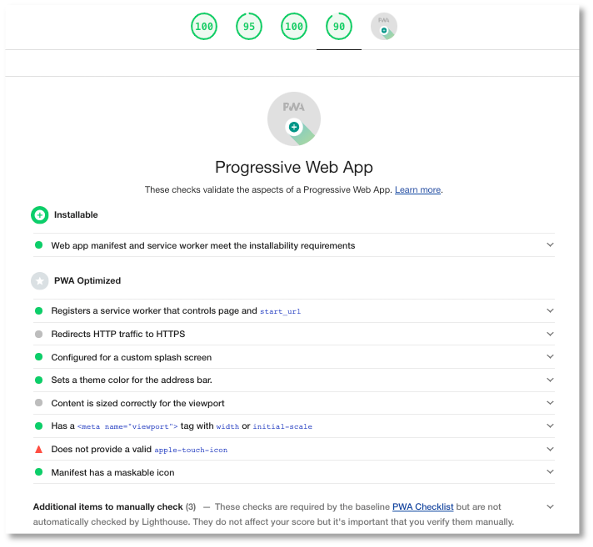

# Zusammenfassung

Wir haben im Laufe des Semesters eine Webanwendung in eine *progressive* Webanwendung umgestaltet. Wir haben verschiedene *progressive* Funktionalitäten ausprobiert und implementiert. Das Konzept einer *progressive Web App* wird zunehmend unterstützt, sowohl von den Browser-Herstellern, als auch von den Entwicklern von JavaScript-Frameworks, wie z.B. Angular. 

Hier nochmal zusammengefasst die Funktionalitäten, die das *progressive*  ausmachen und die wir implementiert haben:

- **auffindbar**; die Webanwendungen können einfach über Suchmaschinen gefunden werden, denn es sind ja *Web*-Anwendungen, der gleiche Grund gilt auch für **verlinkbar**,
- **installierbarr**; mithilfe des WebApp-Manifestes werden Anwendungen installierbar und lassen sich durch Klick auf ein Icon im Browser starten - man sieht aber gar nicht, dass es sich um eine Browser handelt,
- **offline ausführbar**; die Webanwendung ist durch die Verwendung von Cache, IndexedDB und Hintergrundsynchronisation auch ohne Netzwerkverbindung ausführbar,
- **plattformunabhängig**; die Webanwendung läuft in jedem Browser und ist somit unabhängig vom Betriebssystem,
- **nutzerbindend**; durch die Verwendung von (Push-)Nachrichten kann die Nutzerin stets über Aktuelels informiert werden und wird somit dafür interessiert, die Anwendung erneut zu starten,
- **responsive**; PWAs sind hauptsächlich für die Anwendung auf mobilen Geräten konzipiert, können aber genau so sinnvoll auf Desktop-PCs sein und sind deshalb typischerweise responsive gestaltet, 
- **Zugriff auf Geräte**; mit progressiven Webanwendungen kann genau wie mit nativen Anwendungen auf Kamera, Mikrofon, Standard und weitere Sensoren zugegriffen werden. Dafür gibt es mittlerweile viele APIs, die zunehmend mehr von Browsern unterstützt werden.


Für den Fall, dass Sie für Ihre Semesteraufgabe planen, das Frontend mithilfe von Angular zu erstellen, hier noch ein kurzes *Start-Tutorial*. Für Angular lässt sich aus einer existierenden Anwendung (mit dem Namen `*project-name*`) eine *PWA* mithilfe von 

```bash
ng add @angular/pwa --project *project-name*
```

machen. Beachten Sie für Angular, dass `ng serve` nicht für Service Worker funktioniert, sondern Sie, wie in unserer `HTW-Insta`-Anwendung mit dem `http-server` arbeiten müssen. Beispiel:


## Kurzes Start-Tutorial für Angular

Eingabe: 

```bash
ng new AngularPWA
```

Ausgabe:

```bash
? Would you like to add Angular routing? Yes
? Which stylesheet format would you like to use? CSS
CREATE AngularPWA/README.md (1056 bytes)
CREATE AngularPWA/.editorconfig (274 bytes)
CREATE AngularPWA/.gitignore (604 bytes)
CREATE AngularPWA/angular.json (3063 bytes)
CREATE AngularPWA/package.json (1073 bytes)
CREATE AngularPWA/tsconfig.json (783 bytes)
CREATE AngularPWA/.browserslistrc (703 bytes)
CREATE AngularPWA/karma.conf.js (1427 bytes)
CREATE AngularPWA/tsconfig.app.json (287 bytes)
CREATE AngularPWA/tsconfig.spec.json (333 bytes)
CREATE AngularPWA/src/favicon.ico (948 bytes)
CREATE AngularPWA/src/index.html (296 bytes)
CREATE AngularPWA/src/main.ts (372 bytes)
CREATE AngularPWA/src/polyfills.ts (2820 bytes)
CREATE AngularPWA/src/styles.css (80 bytes)
CREATE AngularPWA/src/test.ts (743 bytes)
CREATE AngularPWA/src/assets/.gitkeep (0 bytes)
CREATE AngularPWA/src/environments/environment.prod.ts (51 bytes)
CREATE AngularPWA/src/environments/environment.ts (658 bytes)
CREATE AngularPWA/src/app/app-routing.module.ts (245 bytes)
CREATE AngularPWA/src/app/app.module.ts (393 bytes)
CREATE AngularPWA/src/app/app.component.css (0 bytes)
CREATE AngularPWA/src/app/app.component.html (23809 bytes)
CREATE AngularPWA/src/app/app.component.spec.ts (1069 bytes)
CREATE AngularPWA/src/app/app.component.ts (214 bytes)
✔ Packages installed successfully.
    Successfully initialized git.
```


Eingabe: 

```bash
cd AngularPWA 
ng add @angular/pwa --project AngularPWA
```

Ausgabe:

```bash
ℹ Using package manager: npm
✔ Found compatible package version: @angular/pwa@latest.
✔ Package information loaded.
 
The package @angular/pwa will be installed and executed.
Would you like to proceed? Yes
✔ Package successfully installed.
Option "configuration" is deprecated: No longer has an effect.
CREATE ngsw-config.json (624 bytes)
CREATE src/manifest.webmanifest (1344 bytes)
CREATE src/assets/icons/icon-128x128.png (1253 bytes)
CREATE src/assets/icons/icon-144x144.png (1394 bytes)
CREATE src/assets/icons/icon-152x152.png (1427 bytes)
CREATE src/assets/icons/icon-192x192.png (1790 bytes)
CREATE src/assets/icons/icon-384x384.png (3557 bytes)
CREATE src/assets/icons/icon-512x512.png (5008 bytes)
CREATE src/assets/icons/icon-72x72.png (792 bytes)
CREATE src/assets/icons/icon-96x96.png (958 bytes)
UPDATE angular.json (3232 bytes)
UPDATE package.json (1115 bytes)
UPDATE src/app/app.module.ts (789 bytes)
UPDATE src/index.html (478 bytes)
✔ Packages installed successfully.
```


Eingabe: 

```bash
ng build
```

Ausgabe:

```bash
⠋ Generating browser application bundles (phase: setup)...Compiling @angular/core : es2015 as esm2015
Compiling @angular/common : es2015 as esm2015
Compiling @angular/platform-browser : es2015 as esm2015
Compiling @angular/router : es2015 as esm2015
Compiling @angular/platform-browser-dynamic : es2015 as esm2015
Compiling @angular/service-worker : es2015 as esm2015
✔ Browser application bundle generation complete.
✔ Copying assets complete.
✔ Index html generation complete.
✔ Service worker generation complete.

Initial Chunk Files               | Names         |      Size
main.91513f6b1472da6ef484.js      | main          | 222.83 kB
polyfills.7483c3136b6130f43c00.js | polyfills     |  35.95 kB
runtime.edf4ff6924b895aead86.js   | runtime       |   1.00 kB
styles.31d6cfe0d16ae931b73c.css   | styles        |   0 bytes

                                  | Initial Total | 259.79 kB

Build at: 2021-06-22T09:36:03.581Z - Hash: 01998ed491556b85bad3 - Time: 28665ms
```


Eingabe: 

```bash
http-server -p 8080 -c-1 dist/AngularPWA
```

Ausgabe:

```bash
Starting up http-server, serving dist/AngularPWA
Available on:
  http://127.0.0.1:8080
  http://192.168.1.2:8080
Hit CTRL-C to stop the server
```

Angular empfiehlt auch noch die Verwendung des [App Shell Models](https://developers.google.com/web/fundamentals/architecture/app-shell). Dies kann erfolgen durch 


Eingabe: 

```bash
ng generate app-shell
```

Ausgabe:

```bash
CREATE src/main.server.ts (698 bytes)
CREATE src/app/app.server.module.ts (598 bytes)
CREATE tsconfig.server.json (379 bytes)
CREATE src/app/app-shell/app-shell.component.css (0 bytes)
CREATE src/app/app-shell/app-shell.component.html (24 bytes)
CREATE src/app/app-shell/app-shell.component.spec.ts (641 bytes)
CREATE src/app/app-shell/app-shell.component.ts (286 bytes)
UPDATE package.json (1158 bytes)
UPDATE angular.json (4638 bytes)
UPDATE src/main.ts (432 bytes)
UPDATE src/app/app.module.ts (900 bytes)
✔ Packages installed successfully.

```

Die Anwendung kann nun entweder im Development- (`ng run my-app:app-shell:development`) oder im Production-Modus (`ng run my-app:app-shell:production`) gestartet werden:


Eingabe: 

```bash
ng run AngularPWA:app-shell:development
```

Ausgabe:

```bash
⠋ Generating server application bundles (phase: setup)...⠋ Generating browser application bundles (phase: setup)...Compiling @angular/animations : es2015 as esm2015
Compiling @angular/common/http : es2015 as esm2015
Compiling @angular/platform-server/init : es2015 as esm2015
Compiling @angular/animations/browser : es2015 as esm2015
Compiling @angular/platform-browser/animations : es2015 as esm2015
Compiling @angular/platform-server : es2015 as esm2015
✔ Browser application bundle generation complete.
✔ Copying assets complete.
✔ Index html generation complete.

Initial Chunk Files | Names         |      Size
vendor.js           | vendor        |   2.05 MB
polyfills.js        | polyfills     | 128.55 kB
main.js             | main          |  54.76 kB
runtime.js          | runtime       |   6.22 kB
styles.css          | styles        | 119 bytes

                    | Initial Total |   2.24 MB

Build at: 2021-06-22T09:46:11.341Z - Hash: a1c812f62e199879cc3c - Time: 9895ms
✔ Server application bundle generation complete.

Initial Chunk Files | Names         |    Size
main.js             | main          | 4.61 MB

                    | Initial Total | 4.61 MB

Build at: 2021-06-22T09:46:11.391Z - Hash: 0fbcd120e039051af1c2 - Time: 19807ms
⠋ Generating application shell...Angular is running in development mode. Call enableProdMode() to enable production mode.
✔ Application shell generation complete.

```

Um nicht immer die Cache-Versionen händisch ändern zu müssen - so, wie wir das für die `HTW-Insta`-Anwendung gemacht haben - kann ein Service eingerichtet werden, der die Updates in der Webanwendung erkennt und automatisch die Versionen verwaltet. 


Eingabe: 

```bash
ng generate service log-update
```

Ausgabe:

```bash
CREATE src/app/log-update.service.spec.ts (373 bytes)
CREATE src/app/log-update.service.ts (138 bytes)

```

Dazu wird das [SwUpdate](https://angular.io/api/service-worker/SwUpdate)-Packet aus dem `@angular/service-worker`-Modul verwendet. Die `log-update.service.ts` sieht dann so aus:

=== "src/app/log-update.service.ts"
	```js linenums="1"
	import { Injectable } from '@angular/core';
	import { SwUpdate } from "@angular/service-worker";

	@Injectable({
	  providedIn: 'root'
	})
	export class LogUpdateService {

	  constructor(updates: SwUpdate) {
	    updates.available.subscribe(event => {
	      console.log('current version is', event.current);
	      console.log('available version is', event.available);
	    });
	    updates.activated.subscribe(event => {
	      console.log('old version was', event.previous);
	      console.log('new version is', event.current);
	    });
	  }
	}
	```

Dieser *Service* **erkennt** also neue Updates. Der eigentliche *Reload* der Anwendung bei neuen Updates kann mit dem folgenden Service durchgeführt werden: 


Eingabe: 

```bash
ng generate service prompt-update
```

Ausgabe:

```bash
CREATE src/app/prompt-update.service.spec.ts (388 bytes)
CREATE src/app/prompt-update.service.ts (141 bytes)

```

Dazu wird das [SwUpdate](https://angular.io/api/service-worker/SwUpdate)-Packet aus dem `@angular/service-worker`-Modul verwendet. Die `log-update.service.ts` sieht dann so aus:

=== "src/app/prompt-update.service.ts"
	```js linenums="1"
	import { Injectable } from '@angular/core';
	import { SwUpdate } from "@angular/service-worker";

	@Injectable({
	  providedIn: 'root'
	})
	export class LogUpdateService {

	  constructor(updates: SwUpdate) {
	    updates.available.subscribe(event => {
	      console.log('current version is', event.current);
	      console.log('available version is', event.available);
	    });
	    updates.activated.subscribe(event => {
	      console.log('old version was', event.previous);
	      console.log('new version is', event.current);
	    });
	  }
	}
	```

Wenn Sie eine solch konfigurierte Angular-Anwendung starten, dann ist `Lighthouse` schonmal recht zufrieden:




Weitere Information zu Angular + PWA finden Sie z.B. [hier](https://angular.io/guide/service-worker-intro) oder [hier](https://web.dev/creating-pwa-with-angular-cli/) oder [hier](https://github.com/angular/angular/tree/master/aio/content/examples/service-worker-getting-started) oder [hier](https://medium.com/ngconf/angular-pwa-install-and-configure-858dd8e9fb07) oder [hier](https://angular-buch.com/blog/2019-07-progressive-web-app).


## Ausblick

Zunächst herzlichen Glückwunsch - Sie haben es geschafft! Ich hoffe, Sie haben eine Menge gelernt. Ich denke, dass uns das Thema *Progressive Web Apps* noch eine Weile beschäftigen wird, denn die grundsätzliche Idee dieses Konzeptes ist gut. Wenn die nativen Apps durch progressive Web Apps ersetzt werden würden, dann wären wir nicht nur komplett plattformunabhängig bei der Verwendung von Apps, es wäre nicht mehr notwendig, unterschiedliche Implementierungen für unterschiedliche Plattformen zu erstellen, sondern wir wären insbesondere komplett unabhängig von irgendwelchen App- oder Play-Stores!

Sie können nun mehrere Sachen tun, wenn Sie möchten:

- erstellen Sie Ihr nächstes Projekt gleich als eine PWA oder
- fügen Sie für ein existierendes Projekt PWA-Funktionalität hinzu oder
- tauchen Sie tiefer ein in die APIs, die wir betrachtet haben oder 
- verfolgen Sie die Entwicklung neuer APIs, z.B. `Payments-API` ([Google Pay API](https://developers.google.com/pay/api), [PayPal Payments API](https://developer.paypal.com/docs/api/payments/v1/)) oder [Übersicht](https://rapidapi.com/blog/top-payment-apis-manage-your-payments/)

oder Sie ruhen sich erstmal aus. Einen schönen Sommer!